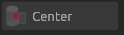
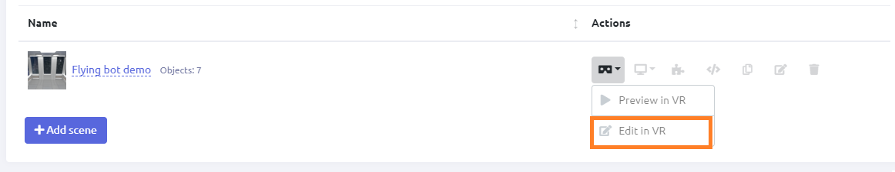

[[[Переключить на
русский]{.underline}](https://docs.google.com/document/d/1CQ-B8TpO31X-ypzS34byHkyKeNdOd_4hCtwexQy4FVs)]{dir="ltr"}

[]{dir="ltr"}

[Contents]{dir="ltr"}

[[[What this is]{.underline}](#what-this-is)]{dir="ltr"}

[[[Creating a project, adding
scenes]{.underline}](#creating-a-project-adding-scenes)]{dir="ltr"}

[[[Adding objects without VR (Desktop
editor)]{.underline}](#editing-without-vr-desktop-editor)]{dir="ltr"}

[[[Adding objects in VR]{.underline}](#editing-in-vr)]{dir="ltr"}

[[[VR menu functions]{.underline}](#vr-menu-functions)]{dir="ltr"}

[[[Composing algorithms]{.underline}](#composing-algorithms)]{dir="ltr"}

[[[App launch configurations and View
mode]{.underline}](#app-launch-configurations-and-view-mode)]{dir="ltr"}

[[[Building apps out of
projects]{.underline}](#building-apps-out-of-projects)]{dir="ltr"}

[What this is]{dir="ltr"}
=========================

[Creating a VR project means building a simulated environment from
ready-made models. The resulting environment will contain required
objects and will function by pre-defined script.]{dir="ltr"}

[Creating a project, adding scenes]{dir="ltr"}
==============================================

1.  [Run Varwin RMS app.]{dir="ltr"}

2.  [Enter the Project List section. Click 'Add Project.' Name your
    > project, then click 'Add.']{dir="ltr"}

{width="5.591959755030621in"
height="3.653173665791776in"}{width="2.8625732720909887in"
height="3.9781353893263343in"}[]{dir="ltr"}

3.  [Your project appeared in the list. The project structure
    > automatically opens at once.]{dir="ltr"}

{width="4.5092716535433075in"
height="2.871923665791776in"}[]{dir="ltr"}

4.  [You are in the Project Structure section. Click 'Add scene'. Name
    > your new scene and select a scene template for it.]{dir="ltr"}

{width="5.815061242344707in"
height="4.403173665791776in"}[]{dir="ltr"}

5.  [Now the scene is added, you can place objects in it. It can be done
    > within or without VR.]{dir="ltr"}

[Editing without VR (Desktop editor)]{dir="ltr"}
================================================

[Use your mouse and keyboard to edit VR scenes. The Desktop Editor
feature allows editing without VR, namely place objects on the scene and
set their positions. To use this feature, click "Edit on
desktop."]{dir="ltr"}

{width="10.015748031496063in"
height="1.9444444444444444in"}[]{dir="ltr"}

[]{dir="ltr"}

{width="10.015748031496063in"
height="4.666666666666667in"}[]{dir="ltr"}

[]{dir="ltr"}

[Capabilities]{dir="ltr"}
-------------------------

-   [place objects on the scene]{dir="ltr"}

-   [move objects, set precise coordinates (choose the exact location
    > with the help of coordinate axes)]{dir="ltr"}

-   [rotate objects along the chosen axis, set precise
    > parameters]{dir="ltr"}

-   [scale objects along the chosen axis, set precise
    > parameters]{dir="ltr"}

-   [search objects within the list]{dir="ltr"}

-   [delete objects]{dir="ltr"}

-   [Shortcuts:]{dir="ltr"}

    -   [Grab: Q]{dir="ltr"}

    -   [Place: W]{dir="ltr"}

    -   [Rotate: E]{dir="ltr"}

    -   [Scale: R]{dir="ltr"}

    -   [Focus on the object: F]{dir="ltr"}

    -   [Clone objects: Ctrl+C, Ctrl+V]{dir="ltr"}

-   [Orthographic projection of the scene available]{dir="ltr"}

-   [Go to VR with one button]{dir="ltr"}

[Controls]{dir="ltr"}
---------------------

[]{dir="ltr"}

**[Toolbar]{dir="ltr"}**

{width="4.71875in"
height="1.6354166666666667in"}[]{dir="ltr"}

[1 - save]{dir="ltr"}

[2 - cancel action]{dir="ltr"}

[3 - repeat action]{dir="ltr"}

[4 - copy]{dir="ltr"}

[5 - paste]{dir="ltr"}

[6 - move camera]{dir="ltr"}

[7 - move object]{dir="ltr"}

[8 - rotate object]{dir="ltr"}

[9 - scale object]{dir="ltr"}

**[Rotation toggle]{dir="ltr"}**

{width="1.3854166666666667in"
height="0.4166666666666667in"}{width="1.3333333333333333in"
height="0.4318405511811024in"}[]{dir="ltr"}

[Local - the object rotation and movement are relative to its own axis.
Global - the object rotates and moves accordingly to world space
orientation.]{dir="ltr"}

**[Position toggle]{dir="ltr"}**

{width="1.28125in"
height="0.3854166666666667in"}{width="1.2916666666666667in"
height="0.3645833333333333in"}[]{dir="ltr"}

[Pivot - the object rotates and moves around its pivot point selected by
the developer. Center - the object rotates and moves around its
geometric center.]{dir="ltr"}

[positions the Gizmo at the actual of a Mesh]{dir="ltr"}

**[Perspective projection toggle]{dir="ltr"}**

{width="5.208333333333333in"
height="4.5625in"}[]{dir="ltr"}

[The toggle switches the perspective projection between standard and
orthographic.]{dir="ltr"}

**[Switch to other modes]{dir="ltr"}**

{width="2.507217847769029in"
height="0.7604166666666666in"}[]{dir="ltr"}

[1 - go to VR]{dir="ltr"}

[2 - go to Desktop View mode\*]{dir="ltr"}

[\*To leave the Desktop View mode, press Escape. You'll receive
suggestions to switch to VR, return to Desktop Edit mode, or cancel
exiting.]{dir="ltr"}

{width="5.300074365704287in"
height="2.773293963254593in"}[]{dir="ltr"}

**[Library and objects]{dir="ltr"}**

[Toggle between the object library and the list of spawned objects. You
can also search objects here.]{dir="ltr"}

[By selecting a spawned object in the list, you also select it on the
scene.]{dir="ltr"}

{width="3.65625in"
height="3.0520833333333335in"}{width="3.7291666666666665in"
height="2.34375in"}[]{dir="ltr"}

[]{dir="ltr"}

**[Object info]{dir="ltr"}**

{width="3.6666666666666665in"
height="3.1666666666666665in"}[]{dir="ltr"}

[Here you can see the name, ID and type of the selected object, and
parameters of its position. Also, here you can delete selected
object.]{dir="ltr"}

[Editing in VR]{dir="ltr"}
==========================

1.  [Click "Edit in VR." You'll see the boot screen, then the scene will
    > open in a new window.]{dir="ltr"}

{width="10.015748031496063in"
height="1.9305555555555556in"}[]{dir="ltr"}

2.  [Open the VR menu and select an object.]{dir="ltr"}

[*How-to*: [[Using controllers
manual]{.underline}](https://drive.google.com/open?id=103KShWrxmJBIRwkcPeKaJNXoTDSB_9Ov_1iI8LjbtI4)]{dir="ltr"}

[*See also:* [[VR menu
functions]{.underline}](#vr-menu-functions)]{dir="ltr"}

{width="3.758406605424322in"
height="2.7872430008748905in"}[]{dir="ltr"}

3.  [Place the object in the scene:]{dir="ltr"}

    a.  [Carry it to the desired place,]{dir="ltr"}

    b.  [Press the Trigger button on your controller,]{dir="ltr"}

    c.  [The object appears in the scene; it will hang in the air or
        > stick to the surface.]{dir="ltr"}

    d.  [At the same time, this object will stay in your hand. You can
        > spawn a lot of identical objects by pressing the Trigger
        > button required number of times.]{dir="ltr"}

    e.  [Press the Grip button to remove the object from your
        > hand.]{dir="ltr"}

{width="2.081324365704287in"
height="1.879090113735783in"}[]{dir="ltr"}

1.  [Open the VR menu and save changes. The objects spawned in VR appear
    > in Varwin RMS interface immediately after you save changes in
    > VR.]{dir="ltr"}

{width="2.6542410323709538in"
height="2.5900251531058616in"}[]{dir="ltr"}

2.  [Go back to the Project Structure tab. You'll see the list of
    > spawned objects appeared in the scene. The objects can be
    > renamed.]{dir="ltr"}

{width="4.393823272090988in"
height="3.7510597112860893in"}[]{dir="ltr"}

[VR menu functions]{dir="ltr"}
==============================

[VR main menu functions:]{dir="ltr"}

-   [Save - save changes,]{dir="ltr"}

-   [Undo - cancel an action,]{dir="ltr"}

-   [Redo - repeat an action,]{dir="ltr"}

-   [Filter - open tag list (learn more:
    > [[Tags]{.underline}](https://docs.google.com/document/d/1LOg1Ts-gDaG43nlDBW80sas961XDlgt1dFUqQe9Ntx8/edit#heading=h.917979yj51bi)),]{dir="ltr"}

-   [Mode - switch mode (Edit/Preview).]{dir="ltr"}

{width="3.9490758967629045in"
height="2.361506999125109in"}[]{dir="ltr"}

[Composing algorithms]{dir="ltr"} 
==================================

1.  [Click 'Open the visual logic editor.']{dir="ltr"}

{width="10.015748031496063in"
height="2.5555555555555554in"} [ ]{dir="ltr"}

2.  [Here you can work with the project script.]{dir="ltr"}

{width="3.622989938757655in"
height="4.501291557305337in"}[]{dir="ltr"}

[*Working with Blockly:*
[[Manual]{.underline}](https://drive.google.com/open?id=1J6C6y2byfLWf3ojLXNg2hGarLVvGczTvG4e_aG42Hi4)]{dir="ltr"}

3.  [Create a script and click 'Apply.' The changes will apply in VR.
    > You can also view the script as code; to do that, click 'Open code
    > editor.']{dir="ltr"}

{width="3.3209076990376203in"
height="3.8854615048118983in"}[]{dir="ltr"}

[App launch configurations and View mode]{dir="ltr"}
====================================================

[When the logic is created, the changes can be viewed in VR.]{dir="ltr"}

[View mode can be switched on if the project has at least one
configuration.]{dir="ltr"}

{width="10.015748031496063in"
height="2.888888888888889in"}[]{dir="ltr"}

[Default configuration is created automatically when the user adds the
first scene to the project. Other custom configurations can be
added.]{dir="ltr"}

[If there are several scenes in the project, the user can select a start
scene.]{dir="ltr"}

{width="7.357365485564304in"
height="3.6818405511811023in"}[]{dir="ltr"}

[Now go to VR to view your algorithm work.]{dir="ltr"}

-   [If VR client already runs, just put on your headset,]{dir="ltr"}

-   [If not, click "View in VR." You will go to View mode.]{dir="ltr"}

{width="2.987574365704287in"
height="0.556509186351706in"}[]{dir="ltr"}

{width="10.015748031496063in"
height="1.8888888888888888in"}[]{dir="ltr"}

[*Creating and checking an algorithm:* [[Watch
video]{.underline}](https://drive.google.com/open?id=1pHK66oXJT-UYyCzBE875IpohBbCOoTg3)]{dir="ltr"}

[Building apps out of projects]{dir="ltr"}
==========================================

[When the project is completed, an app for the end user can be built out
of it. The apps are exported as .exe files. They can be launched on any
PC.]{dir="ltr"}

[Varwin platform installation is not needed to launch an exported
app.]{dir="ltr"}

{width="10.015748031496063in"
height="1.2916666666666667in"}[]{dir="ltr"}

[*Export of ready apps (not available for Starter edition)*]{dir="ltr"}
