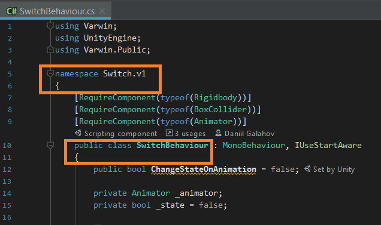

[[[Переключить на
русский]{.underline}](https://docs.google.com/document/d/1qWbauNowvlUKt824PZgd07-qz1brH7rf8uZaQIp9wWA)]{dir="ltr"}

[]{dir="ltr"}

[In order to use the same classes for different objects, it's necessary
to create a library to store these classes in.]{dir="ltr"}

[]{dir="ltr"}

-   [Create a directory which will contain the classes of the library\
    > ]{dir="ltr"}

{width="6.796337489063867in"
height="0.8615080927384077in"}[]{dir="ltr"}

[]{dir="ltr"}

-   [Create an .asmdef file describing the library's dll. Name it. Add
    > link to the core library, VarwinCore, to Assembly Definition
    > References section. Click Apply to save changes.]{dir="ltr"}

[]{dir="ltr"}

{width="3.695906605424322in"
height="2.9079472878390202in"} [ ]{dir="ltr"}
{width="3.2346522309711285in"
height="4.309424759405075in"}[]{dir="ltr"}

[]{dir="ltr"}

-   [Create or add to the directory all the required classes. They have
    > to be stored in the same namespace with a unique name representing
    > the library.]{dir="ltr"}

[]{dir="ltr"}

{width="2.1646576990376203in"
height="1.3183923884514435in"} [ ]{dir="ltr"}
{width="5.102156605424322in"
height="3.023500656167979in"}[]{dir="ltr"}

[]{dir="ltr"}

-   [Go to .asmdef file of the object which needs to be linked with the
    > created library. Add the link to the library to the Assembly
    > Definition References section. Click Apply to save
    > changes.]{dir="ltr"}

[]{dir="ltr"}

{width="7.515748031496063in"
height="3.9722222222222223in"}[]{dir="ltr"}

[]{dir="ltr"}

-   [Now all the classes from the library can be used for the object
    > linked with it. There can be any number of such objects, and all
    > of them can use the shared code from the library.]{dir="ltr"}

[]{dir="ltr"}

{width="5.300074365704287in"
height="3.794041994750656in"}[]{dir="ltr"}
