[[[Переключить на
русский]{.underline}](https://docs.google.com/document/d/1iFTH4kVb7cpsRCIlG6E4HXQKONMxZiTd8wug5TFAtm4)]{dir="ltr"}

[]{dir="ltr"}

[Contents]{dir="ltr"}

[[[Creating objects]{.underline}](#creating-objects)]{dir="ltr"}

[[[Example]{.underline}](#example)]{dir="ltr"}

[[[Working with
attributes]{.underline}](#working-with-attributes)]{dir="ltr"}

> [[[Logic]{.underline}](#logic)]{dir="ltr"}
>
> [[[Actions]{.underline}](#actions)]{dir="ltr"}
>
> [[[Events]{.underline}](#events)]{dir="ltr"}
>
> [[[Variables]{.underline}](#variables)]{dir="ltr"}
>
> [[[Creating drop-down
> lists]{.underline}](#creating-drop-down-lists)]{dir="ltr"}

[[[Objects versioning]{.underline}](#objects-versioning)]{dir="ltr"}

[[[Additional materials]{.underline}](#additional-materials)]{dir="ltr"}

[Creating objects]{dir="ltr"}
=============================

-   [Create or import a game object and save it as a prefab.]{dir="ltr"}

-   [Select the prefab in its folder.]{dir="ltr"}

-   [Open VARWIN SDK -\> Create -\> Object]{dir="ltr"}

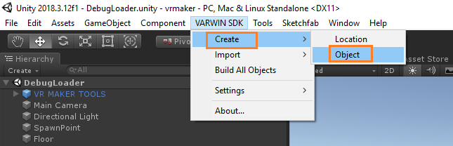{width="5.612574365704287in"
height="1.8099464129483815in"}[]{dir="ltr"}

[]{dir="ltr"}

-   [Select an object, name it. Add tags for fast search. Fill in the
    > info about the object's author.]{dir="ltr"}

-   [Click Create. You'll be asked to wait several moments]{dir="ltr"}

[ ]{dir="ltr"}
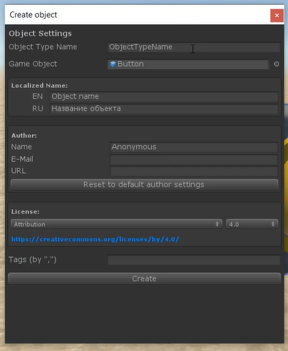{width="3.539005905511811in"
height="4.308819991251093in"}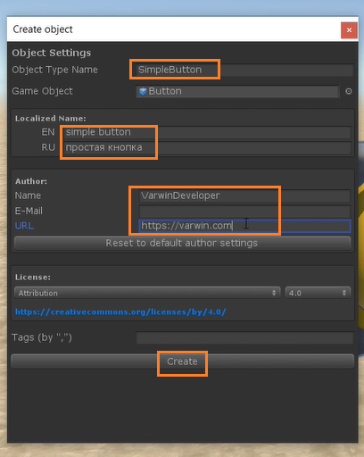{width="3.4660892388451443in"
height="4.329945319335083in"}[]{dir="ltr"}

-   [Your object has been created. It consists of:]{dir="ltr"}

    a.  [object prefab,]{dir="ltr"}

    b.  [.asmdef file (for object code compilation),]{dir="ltr"}

    c.  [object class stored in a unique namespace. Should the need
        > arise to add more classes, they will have to be stored in the
        > same directory and the same namespace.]{dir="ltr"}

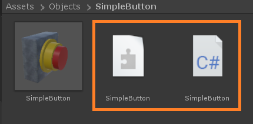{width="3.6027176290463694in"
height="1.7634930008748906in"}[]{dir="ltr"}

-   [SimpleButton class has been created for the object. It inherits
    > VarwinObject This is the main object class, which connects the
    > object with the platform.]{dir="ltr"}

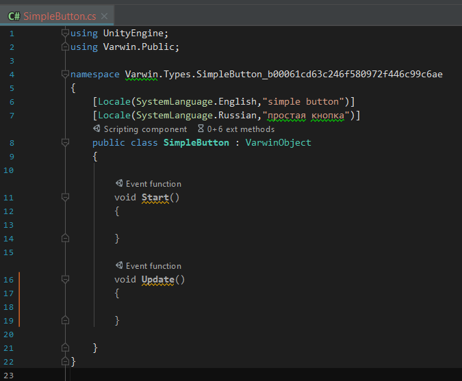{width="4.828009623797025in"
height="3.986506999125109in"}[]{dir="ltr"}

> [Everything is ready for writing object code.]{dir="ltr"}

[Example]{dir="ltr"}
====================

[The object has a method "ChangeState" in its main class. The method
changes bool variable IsPressed.]{dir="ltr"}

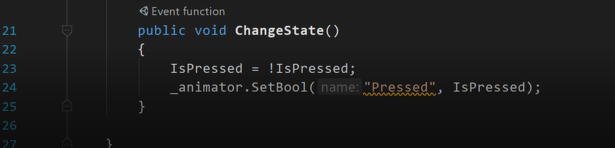{width="9.114583333333334in"
height="2.1979166666666665in"}[]{dir="ltr"}

-   [To connect this method with pulling the trigger on a controller
    > ("Use"): select method "ChangeState" in Interactable Object
    > Behavior]{dir="ltr"}

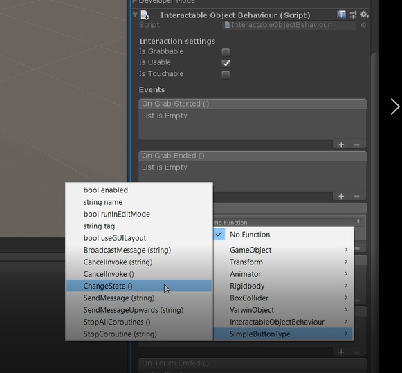{width="4.925074365704287in"
height="4.569900481189851in"}[]{dir="ltr"}

-   [You will have to create a function for Blockly, write an attribute
    > for it (in this case, Checker) and name it]{dir="ltr"}

[ ]{dir="ltr"}
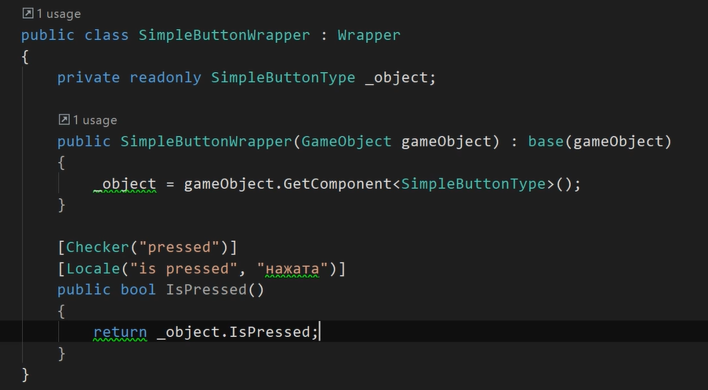{width="5.664005905511811in"
height="3.1249693788276467in"}[]{dir="ltr"}

-   [Should this object have several methods, Blockly will group them
    > within one block within this name.]{dir="ltr"}

    -   [E.g., if we create another state of the button, "is
        > released",]{dir="ltr"}

[\[Checker(\"pressed\")\]]{dir="ltr"}

[\[Locale(SystemLanguage.English, \"is released\")\]]{dir="ltr"}

[\[Locale(SystemLanguage.Russian, \"отпущена\")\]]{dir="ltr"}

[public bool IsReleased()]{dir="ltr"}

[{]{dir="ltr"}

[ return !IsPressed;]{dir="ltr"}

[}]{dir="ltr"}

-   [Blockly will group these methods this way:]{dir="ltr"}

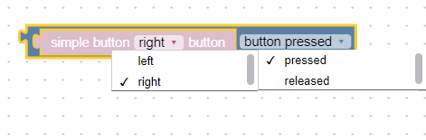{width="4.414657699037621in"
height="1.1060476815398075in"}[]{dir="ltr"}

*[Blocks grouping example]{dir="ltr"}*

-   [Localization]{dir="ltr"}

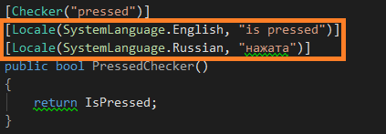{width="4.40625in"
height="1.53125in"}[]{dir="ltr"}

*[Command localization]{dir="ltr"}*

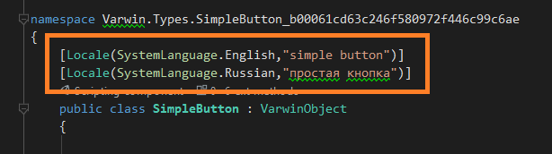{width="6.395833333333333in"
height="1.7916666666666667in"}[]{dir="ltr"}

*[Object name localization]{dir="ltr"}*

-   [Everything is ready for object building. Click Build.]{dir="ltr"}

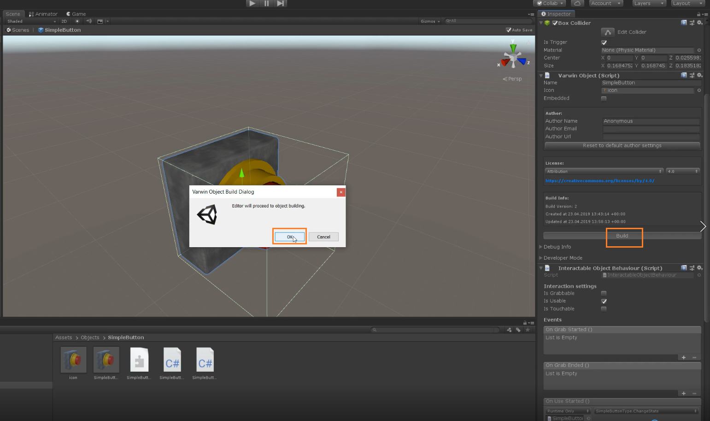{width="8.512285651793526in"
height="5.0351192038495185in"}[]{dir="ltr"}

-   [When the object is ready, the folder containing it will open. Now
    > you can upload the object into Varwin library.]{dir="ltr"}

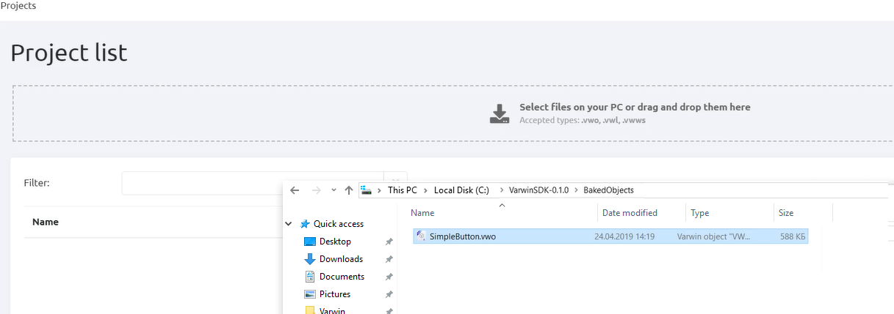{width="10.015748031496063in"
height="3.5277777777777777in"} [ ]{dir="ltr"}

-   [The object appears in the library]{dir="ltr"}

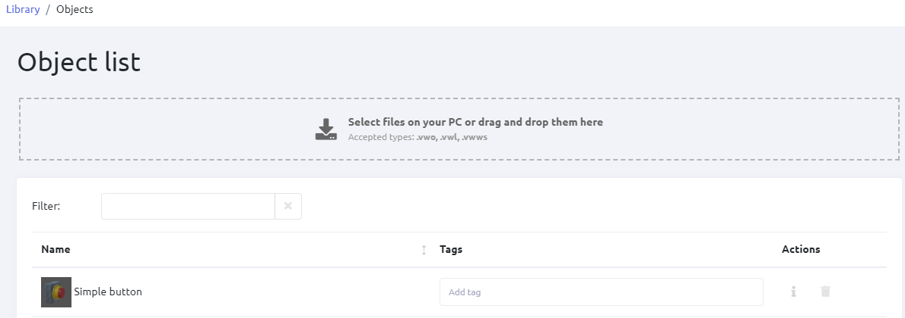{width="7.487574365704287in"
height="2.6378740157480314in"} [ ]{dir="ltr"}

-   [Now you can place the object into a scene in VR. Click
    > Save.]{dir="ltr"}

-   [Now the object appears in the scene. Open Blockly. You'll see logic
    > blocks that have been created for the object.]{dir="ltr"}

[ ]{dir="ltr"}
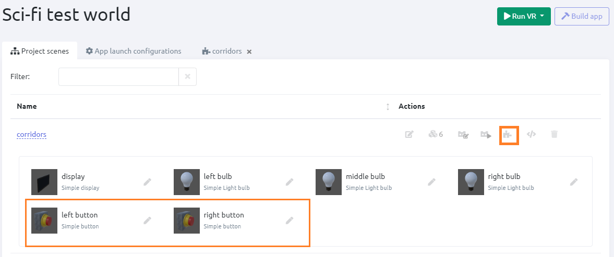{width="6.486922572178478in"
height="2.713727034120735in"}[]{dir="ltr"}

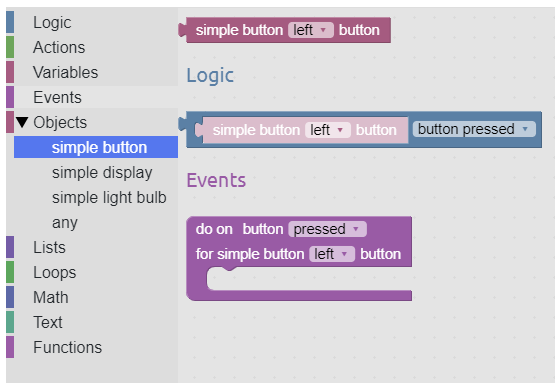{width="5.039656605424322in"
height="3.477817147856518in"}[]{dir="ltr"}

[Working with attributes]{dir="ltr"}
====================================

[**Wrapper class** is necessary for transferring VarwinObject to
Blockly. In order to obtain an object of this type for a specific
VarwinObject use GetWrapper() method.]{dir="ltr"}

[]{dir="ltr"}

[Examples]{dir="ltr"}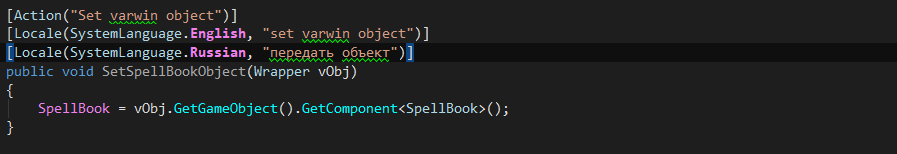{width="7.515748031496063in"
height="1.2916666666666667in"}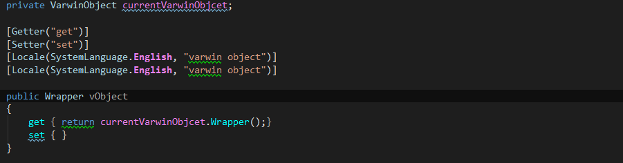{width="7.515748031496063in"
height="1.9722222222222223in"}[]{dir="ltr"}

[Logic]{dir="ltr"}
------------------

[**checker** - logic attribute. Checks true\\false.]{dir="ltr"}

[]{dir="ltr"}

**[Example]{dir="ltr"}**

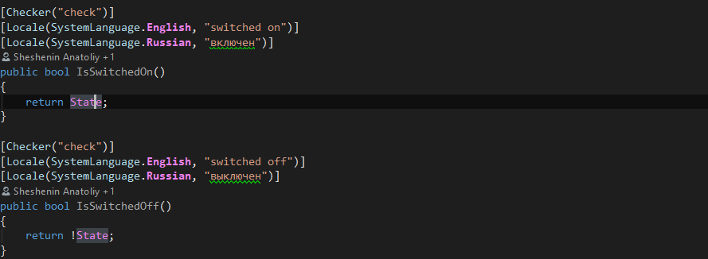{width="6.270833333333333in"
height="2.3055555555555554in"}[]{dir="ltr"}

[Actions]{dir="ltr"}
--------------------

[**action** with objects. These are common methods which can receive or
return the following types:]{dir="ltr"}

[]{dir="ltr"}

-   [simple types float, int, bool, string]{dir="ltr"}

-   [objects of the Wrapper type]{dir="ltr"}

-   [all the above in bulk]{dir="ltr"}

[]{dir="ltr"}

**[Example]{dir="ltr"}**

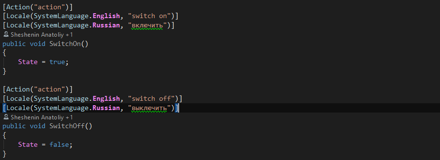{width="6.270833333333333in"
height="2.2777777777777777in"}[]{dir="ltr"}

[Events]{dir="ltr"}
-------------------

[**event**.]{dir="ltr"}

[]{dir="ltr"}

[The following types can be transferred:]{dir="ltr"}

-   [simple types float, int, bool, string]{dir="ltr"}

-   [objects of the Wrapper type]{dir="ltr"}

-   [all the above in bulk]{dir="ltr"}

[]{dir="ltr"}

**[Example]{dir="ltr"}**

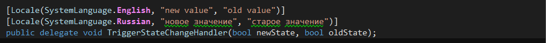{width="6.270833333333333in"
height="0.5in"}[]{dir="ltr"}

{width="6.270833333333333in"
height="0.7638888888888888in"}[]{dir="ltr"}

[Variables]{dir="ltr"}
----------------------

[]{dir="ltr"}

[Variables can belong to the following types:]{dir="ltr"}

[]{dir="ltr"}

-   [simple types float, int, bool, string]{dir="ltr"}

-   [objects of the Wrapper type]{dir="ltr"}

-   [all the above in bulk]{dir="ltr"}

[]{dir="ltr"}

[get - receive a state]{dir="ltr"}

[set - appoint a state]{dir="ltr"}

[]{dir="ltr"}

**[Example]{dir="ltr"}**

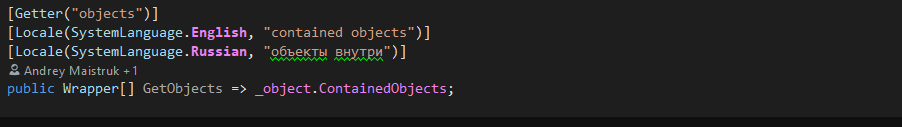{width="6.270833333333333in"
height="0.8888888888888888in"}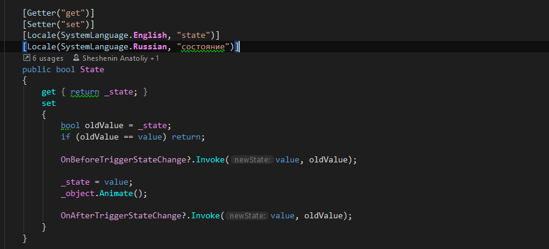{width="6.270833333333333in"
height="2.8472222222222223in"}[]{dir="ltr"}

[Creating drop-down lists]{dir="ltr"}
-------------------------------------

[]{dir="ltr"}

[Creating values for the list]{dir="ltr"}

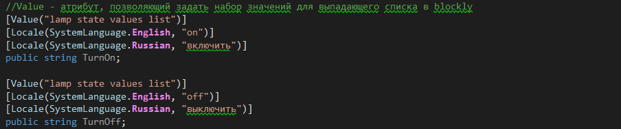{width="6.270833333333333in"
height="1.3055555555555556in"}[]{dir="ltr"}

[Using the list]{dir="ltr"}

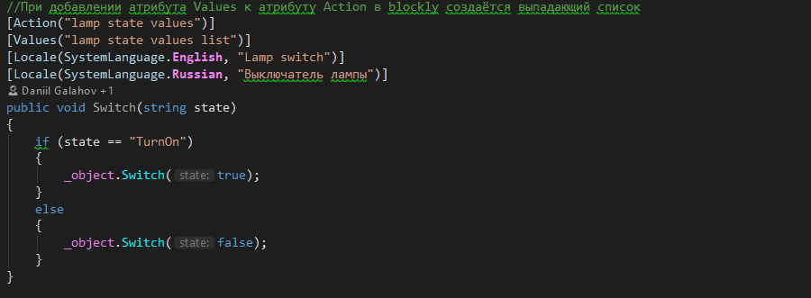{width="6.270833333333333in"
height="2.3055555555555554in"}[]{dir="ltr"}

[Objects versioning]{dir="ltr"}
===============================

[Create new versions of existing objects.]{dir="ltr"}

[]{dir="ltr"}

-   [[[Objects, scene templates
    > versioning]{.underline}](https://docs.google.com/document/d/1173FW8w7Yf8jQLwJXJqffxpf_xFNhDjAVosemPjr3Bo):
    > instruction]{dir="ltr"}

[Additional materials]{dir="ltr"}
=================================

[Video guides:
[[1]{.underline}](https://www.youtube.com/watch?v=-pbF88u06pI&list=PLz2Z4tRuWcpWOhy-z19iBZurvaW95FXcD&index=1),
[[2]{.underline}](https://www.youtube.com/watch?v=pTngHii9jqY&list=PLz2Z4tRuWcpWOhy-z19iBZurvaW95FXcD&index=2),
[[3]{.underline}](https://www.youtube.com/watch?v=YtiJ_O792dU&list=PLz2Z4tRuWcpWOhy-z19iBZurvaW95FXcD&index=3)]{dir="ltr"}
