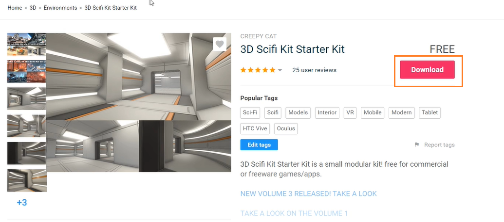
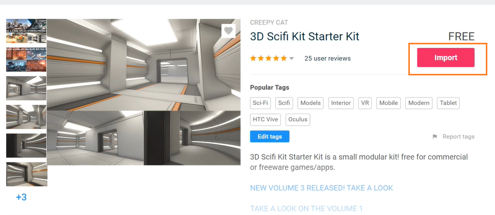
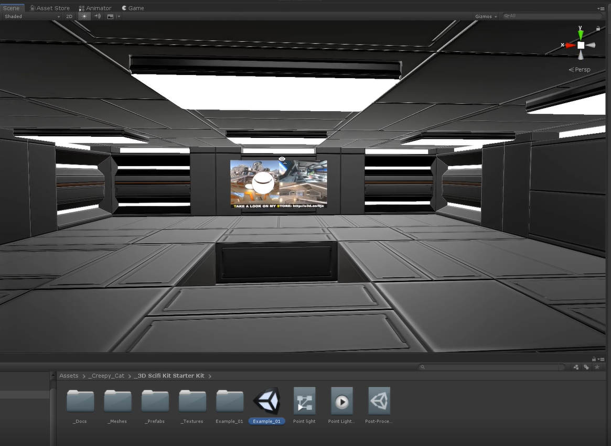
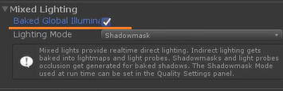
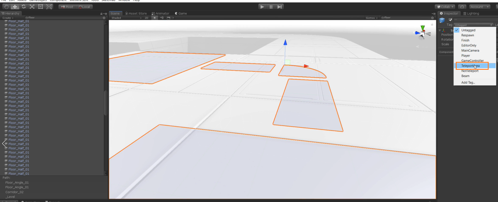
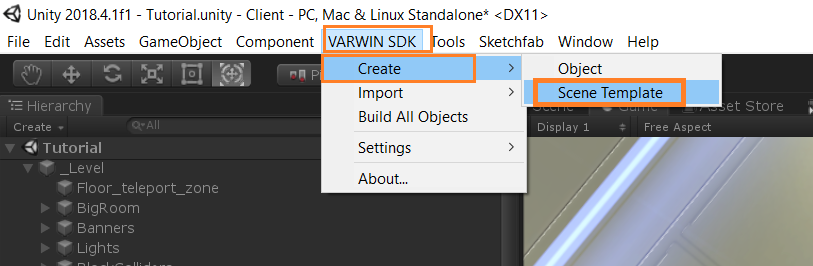
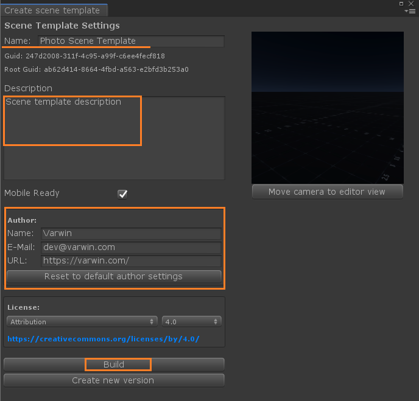
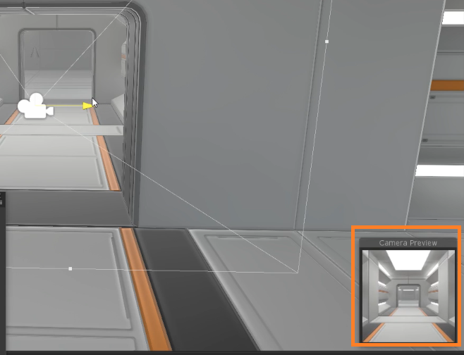
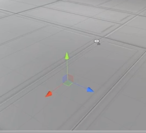
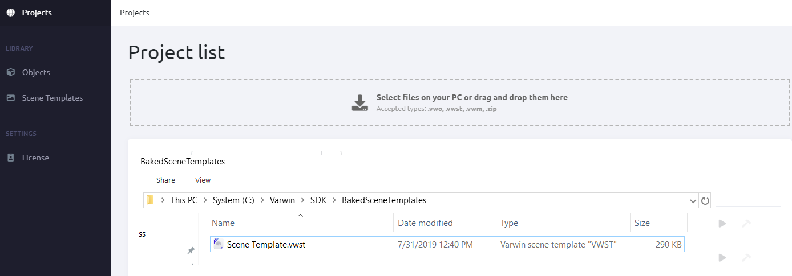

[[[Переключить на
русский]{.underline}](https://docs.google.com/document/d/1ymOBGuzSWDeqsZWAVpmpa5OjbUcPeKY0vwr_D87WhMQ)]{dir="ltr"}

[]{dir="ltr"}

[1. Select an asset from Asset Store. Download and import
it.]{dir="ltr"}

{width="5.310491032370954in"
height="2.3395866141732284in"}{width="3.371801181102362in"
height="1.0333825459317585in"}[]{dir="ltr"}

[2. Open test scene that comes with the asset.]{dir="ltr"}

{width="4.614212598425197in"
height="3.371923665791776in"}[]{dir="ltr"}

[]{dir="ltr"}

[You can create a scene template for Varwin from virtually and Unity
scene with game objects.]{dir="ltr"}

[Restrictions:]{dir="ltr"}

-   [the scene can't have any scripts that don't belong to Varwin
    > SDK]{dir="ltr"}

-   [there can be no cameras on the scene]{dir="ltr"}

[Don't forget about light baking.]{dir="ltr"}

{width="3.6979166666666665in"
height="1.1979166666666667in"}[]{dir="ltr"}

[3. Mark those colliders to which a player will be able to teleport with
TeleportArea tag.]{dir="ltr"}
{width="9.618061023622047in"
height="3.903173665791776in"}[]{dir="ltr"}

[4. Now you can build the scene template. Open Varwin SDK - Create -
Scene Template.]{dir="ltr"}

{width="6.956324365704287in"
height="2.2773108048993875in"}[]{dir="ltr"}

[5. A window will open where you can name the scene template and give it
a description. Fill in the information about the author of the scene
template. You'll also see a preview that will be used as an icon for
your scene template.]{dir="ltr"}

{width="4.706324365704287in"
height="4.515784120734908in"}[]{dir="ltr"}

[At this stage, World Descriptor that contains 2 objects are
automatically added:]{dir="ltr"}

-   [preview camera - the only camera that can be placed at the scene.
    > You can put it anywhere to get a nice preview.]{dir="ltr"}

{width="4.685489938757655in"
height="3.592209098862642in"}[]{dir="ltr"}

-   [spawn point - point where the player will appear when the scene
    > template loads. The direction of the blue arrow shows the
    > direction of the player's eyes at the moment of spawn.]{dir="ltr"}

{width="2.3209076990376203in"
height="2.09823709536308in"}[]{dir="ltr"}

[.]{dir="ltr"}

[6. When everything is ready, click Build and wait for the scene
template file to be built.]{dir="ltr"}

[7. Upload the file into Varwin library.]{dir="ltr"}

{width="10.015748031496063in"
height="3.5in"}[]{dir="ltr"}

[8. Now you can create a project
([[manual]{.underline}](https://drive.google.com/open?id=1ji8IlKHhGR5aJDMzmPGu1I-DVEx0i7xq8PQAft2oDqo))
and use your new scene template in it.]{dir="ltr"}

[9. Create new versions of existing objects/scene templates.]{dir="ltr"}

-   [[[Objects, scene templates
    > versioning]{.underline}](https://docs.google.com/document/d/1173FW8w7Yf8jQLwJXJqffxpf_xFNhDjAVosemPjr3Bo):
    > instruction]{dir="ltr"}

[]{dir="ltr"}

[**Additional: [[Video
guide]{.underline}](https://www.youtube.com/watch?v=o1Gtf1KcnG4&list=PLz2Z4tRuWcpWOhy-z19iBZurvaW95FXcD&index=6&t=0s)**]{dir="ltr"}
