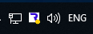
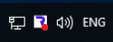
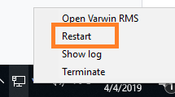
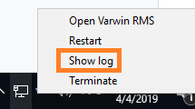
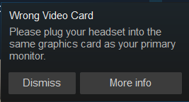
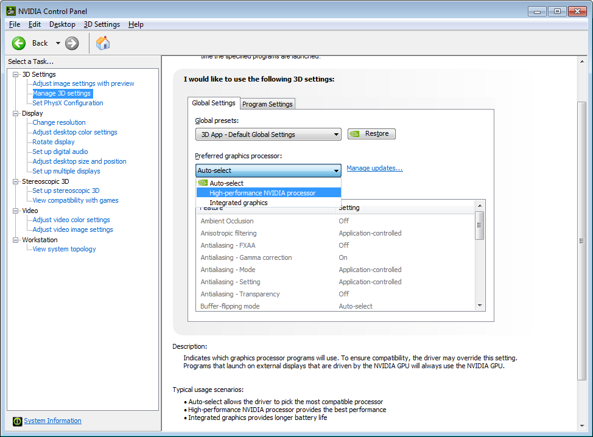
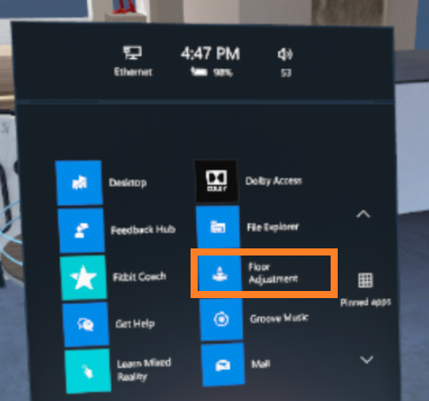
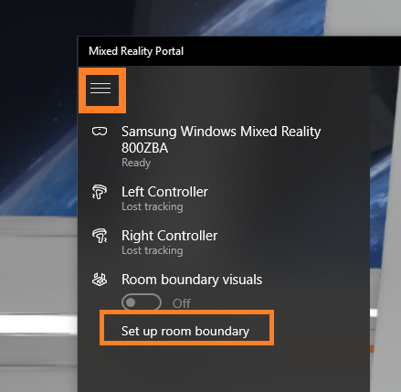

[[[Переключить на
русский]{.underline}](https://docs.google.com/document/d/1nFkmWVYxjEHAd8lg3hw0oOnx_vBmHMJBziBYwffnZ0U/edit)]{dir="ltr"}

[]{dir="ltr"}

[Contents]{dir="ltr"}

[[[Installation and
launch]{.underline}](#installation-and-launch)]{dir="ltr"}

> [[[Can't install
> Varwin]{.underline}](#cant-install-varwin)]{dir="ltr"}
>
> [[[Can't launch Varwin]{.underline}](#cant-launch-varwin)]{dir="ltr"}
>
> [[[Varwin RMS interface is not displayed / is displayed
> incorrectly]{.underline}](#varwin-rms-interface-is-not-displayed-is-displayed-incorrectly)]{dir="ltr"}

[[[Issues with files]{.underline}](#issues-with-files)]{dir="ltr"}

> [[[Can't import a file into the
> library]{.underline}](#cant-import-a-file-into-the-library)]{dir="ltr"}

[[[VR client launch]{.underline}](#vr-client-launch)]{dir="ltr"}

> [[[Can't launch VR
> client]{.underline}](#cant-launch-vr-client)]{dir="ltr"}
>
> [[[VR client is running, but headset displays black
> screen]{.underline}](#vr-client-is-running-but-headset-displays-black-screen)]{dir="ltr"}
>
> [[[VR client is running, but nothing
> happens]{.underline}](#vr-client-is-running-but-nothing-happens)]{dir="ltr"}

[[[Other VR client
issues]{.underline}](#other-vr-client-issues)]{dir="ltr"}

> [[[Controllers are not
> displayed]{.underline}](#controllers-are-not-displayed)]{dir="ltr"}
>
> [[[Controllers are displayed in incorrect
> place]{.underline}](#controllers-are-displayed-in-an-incorrect-place)]{dir="ltr"}
>
> [[[Incorrect floor or horizon
> level]{.underline}](#incorrect-floor-or-horizon-level)]{dir="ltr"}
>
> [[[VR client crashes (no error
> notification)]{.underline}](#vr-client-crashes-no-error-notification)]{dir="ltr"}

[[[VR client displays
error]{.underline}](#vr-client-displays-error)]{dir="ltr"}

> [[[Compilation error / Logic execution failure / Logic initialization
> failure]{.underline}](#compilation-error-logic-execution-failure-logic-initialization-failure)]{dir="ltr"}
>
> [[[Can\'t read command line arguments / Server disconnected / Can\'t
> save / Server is
> unavailable]{.underline}](#cant-read-command-line-arguments-server-disconnected-cant-save-server-is-unavailable)]{dir="ltr"}
>
> [[[Can\'t load object]{.underline}](#cant-load-object)]{dir="ltr"}
>
> [[[Can\'t load scene template]{.underline}]{dir="ltr"} [[/ Player
> spawn point not
> found]{.underline}]{dir="ltr"}](#cant-load-scene-template-player-spawn-point-not-found)[]{dir="ltr"}
>
> [[[World configuration error / Unknown
> error]{.underline}](#world-configuration-error-unknown-error)]{dir="ltr"}

[Installation and launch]{dir="ltr"}
====================================

[Can't install Varwin]{dir="ltr"} 
----------------------------------

1.  [Check if your PC complies with [[system requirements
    > (link)]{.underline}](https://drive.google.com/open?id=1YnVCUts-NDuexkL_8lpMPlc_u6LR5m7oym-3rylly-g)]{dir="ltr"}

2.  [Contact Varwin technical support at
    > [[support\@varwin.com]{.underline}](mailto:support@varwin.com).
    > Describe your issue (we recommend to attach a screenshot of the
    > error.)]{dir="ltr"}

[Can't launch Varwin]{dir="ltr"}
--------------------------------

-   [A yellow dot on the Varwin icon means the program is launching.
    > This may take several minutes.]{dir="ltr"}

{width="1.25623687664042in"
height="0.46567366579177605in"}[]{dir="ltr"}

[]{dir="ltr"}

-   [A red dot on the icon means an error has occurred during the
    > launch.]{dir="ltr"}

> [ ]{dir="ltr"}
> {width="1.272765748031496in"
> height="0.47855971128608926in"}[]{dir="ltr"}
>
> [In this case, try the following *(hereinafter, try each successive
> action if the preceding one hasn't helped)*:]{dir="ltr"}

1.  [Open Varwin menu by right- or left-clicking on Varwin icon. Restart
    > Varwin]{dir="ltr"}

{width="2.2395833333333335in"
height="1.25in"}[]{dir="ltr"}

2.  [Restart Windows]{dir="ltr"}

3.  [Make sure you've allowed access to Varwin services in Windows
    > Firewall\*]{dir="ltr"}

[\*At the first launch, you will get several notifications from Windows
Firewall. Select "Allow access" (by doing this, you allow access to
certain Varwin services, without which the platform won't
run.]{dir="ltr"}

4.  [Open Varwin menu, select Show Log]{dir="ltr"}

{width="2.2395833333333335in"
height="1.25in"}[]{dir="ltr"}

5.  [Contact Varwin technical support at
    > [[support\@varwin.com]{.underline}](mailto:support@varwin.com) and
    > send them the log (internet connection required)]{dir="ltr"}

[Varwin RMS interface is not displayed / is displayed incorrectly]{dir="ltr"} 
------------------------------------------------------------------------------

1.  [Contact Varwin technical support at
    > [[support\@varwin.com]{.underline}](mailto:support@varwin.com).
    > Describe your issue (we recommend to attach a screenshot of the
    > error.)]{dir="ltr"}

[Issues with files]{dir="ltr"}
==============================

[Can't import a file into the library]{dir="ltr"}
-------------------------------------------------

> [If the file has been archived: make sure the archive was unpacked
> before the import.]{dir="ltr"}

[VR client launch]{dir="ltr"}
=============================

[Can't launch VR client]{dir="ltr"}
-----------------------------------

1.  [Check if your VR equipment and your PC comply with [[system
    > requirements
    > (link)]{.underline}](https://drive.google.com/open?id=1YnVCUts-NDuexkL_8lpMPlc_u6LR5m7oym-3rylly-g)]{dir="ltr"}

2.  [Reinstall Varwin platform]{dir="ltr"}

[VR client is running, but headset displays black screen]{dir="ltr"} 
---------------------------------------------------------------------

1.  [*For Windows Mixed Reality equipment*: check your equipment
    > manual]{dir="ltr"}

2.  [*For HTC Vive equipment:* check if your base stations are on and
    > you are inside their coverage area]{dir="ltr"}

3.  [Restart Steam VR]{dir="ltr"}

4.  [Restart your PC]{dir="ltr"}

5.  [Check if other VR apps work well with your equipment.]{dir="ltr"}

    a.  [If yes: contact Varwin technical support at
        > [[support\@varwin.com]{.underline}](mailto:support@varwin.com).]{dir="ltr"}

    b.  [If no: contact customer support of the manufacturer of your
        > equipment.]{dir="ltr"}

[VR client is running, but nothing happens]{dir="ltr"}
------------------------------------------------------

[Choosing an integrated graphics card in the computer system can cause
this error (see screenshot.) It will be seen in the VR. Varwin platform
will run the VR client, but it won't operate.]{dir="ltr"}

{width="2.78125in"
height="1.5in"}[]{dir="ltr"}

[In this case, switch to discrete graphics:]{dir="ltr"}

[1. Right-click on Windows desktop, select the NVIDIA control panel from
the menu.]{dir="ltr"}

[2. Select "Manage 3D settings."]{dir="ltr"}

[3. Select "Global Settings, then in the section "Preferred graphics
processor" select "High-performance processor".]{dir="ltr"}

{width="8.950500874890638in"
height="6.598007436570429in"}[]{dir="ltr"}

[]{dir="ltr"}

[Other VR client issues]{dir="ltr"}
===================================

[Controllers are not displayed]{dir="ltr"} 
-------------------------------------------

1.  [Make sure the controllers are charged and switched on.]{dir="ltr"}

2.  [Restart VR client.]{dir="ltr"}

3.  [Restart Steam VR.]{dir="ltr"}

[Controllers are displayed in an incorrect place]{dir="ltr"}
------------------------------------------------------------

1.  [Move the controllers and headset a little.]{dir="ltr"}

2.  [Restart VR client.]{dir="ltr"}

3.  [Restart Steam VR.]{dir="ltr"}

4.  [Restart your PC]{dir="ltr"}

5.  [Recalibrate your headset (check your equipment manual)]{dir="ltr"}

[Incorrect floor or horizon level]{dir="ltr"} 
----------------------------------------------

1.  [Move the controllers and headset a little.]{dir="ltr"}

2.  [Restart VR client.]{dir="ltr"}

3.  [Restart Steam VR.]{dir="ltr"}

4.  [*For Windows Mixed Reality (floor):*]{dir="ltr"}

    a.  [In VR, enter Mixed Reality Portal]{dir="ltr"}

        i.  [For that, press the Windows button on your controller,
            > after that click 'Home' button in VR.]{dir="ltr"}

        ii. [Please note: Varwin app will be closed.]{dir="ltr"}

    b.  [Enter 'All Apps']{dir="ltr"}

    c.  [Run 'Room Adjustment' or 'Floor Adjustment' (precise name
        > depends on your Windows version)]{dir="ltr"}

    d.  [Rectify floor level, following the instruction that will
        > appear.]{dir="ltr"}

{width="3.639037620297463in"
height="3.403173665791776in"}[]{dir="ltr"}

5.  *[For Windows Mixed Reality (horizon):]{dir="ltr"}*

    e.  [Out of VR, open Mixed Reality Portal (it usually runs along
        > with your Varwin VR client, in a separate window)]{dir="ltr"}

    f.  [Click 'Menu' button (three lines in the upper left part of the
        > screen)]{dir="ltr"}

    g.  [Select 'Run Setup' or 'Set up Room Boundary' (the precise name
        > depends on your Windows version)]{dir="ltr"}

    h.  [Rectify your headset settings, following the instruction that
        > will appear.]{dir="ltr"}

{width="3.583350831146107in"
height="3.5073403324584427in"}[]{dir="ltr"}

6.  [Recalibrate your headset (check your equipment manual)]{dir="ltr"}

7.  [Restart your PC]{dir="ltr"}

[VR client crashes (no error notification)]{dir="ltr"}
------------------------------------------------------

1.  [Make sure SteamVR / Oculus Rift / Windows Mixed Reality is
    > running]{dir="ltr"}

2.  [Contact Varwin technical support at
    > [[support\@varwin.com]{.underline}](mailto:support@varwin.com).
    > Please attach your logs ('Show Log' in Varwin menu)]{dir="ltr"}

{width="2.2395833333333335in"
height="1.25in"}[]{dir="ltr"}

[VR client displays error]{dir="ltr"}
=====================================

[Compilation error / Logic execution failure / Logic initialization failure]{dir="ltr"}
---------------------------------------------------------------------------------------

> [Check your Blockly scenario. Please note: blocks with issues will be
> illuminated.]{dir="ltr"}

[Can\'t read command line arguments / Server disconnected / Can\'t save / Server is unavailable]{dir="ltr"}
-----------------------------------------------------------------------------------------------------------

1.  [Restart Varwin.]{dir="ltr"}

2.  [Reinstall Varwin.]{dir="ltr"}

3.  [Contact Varwin technical support at
    > [[support\@varwin.com]{.underline}](mailto:support@varwin.com)]{dir="ltr"}

[Can\'t load object]{dir="ltr"}
-------------------------------

> [Contact the creator of the object.]{dir="ltr"}

[Can\'t load scene template / Player spawn point not found]{dir="ltr"}
----------------------------------------------------------------------

> [Contact the creator of the scene template.]{dir="ltr"}

[World configuration error / Unknown error]{dir="ltr"}
------------------------------------------------------

> [Contact Varwin technical support at
> [[support\@varwin.com]{.underline}](mailto:support@varwin.com). Please
> attach your logs ('Show Log' in Varwin menu)]{dir="ltr"}

{width="2.2395833333333335in"
height="1.25in"}[]{dir="ltr"}

[]{dir="ltr"}
