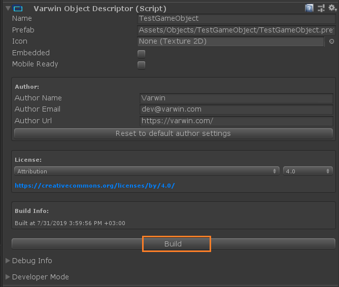
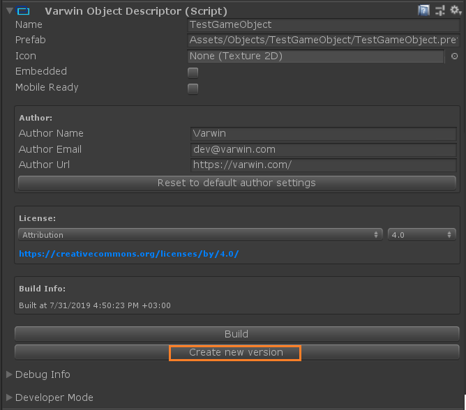
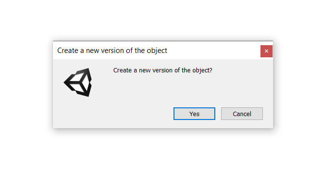
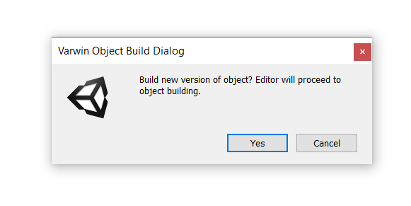
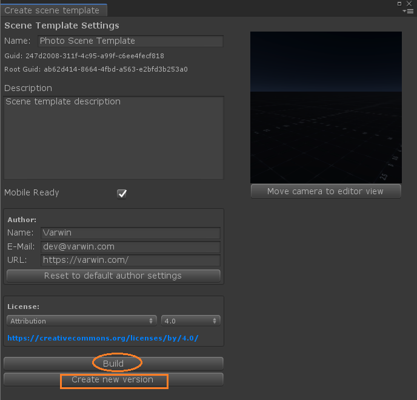

[[[Переключить на
русский]{.underline}](https://docs.google.com/document/d/1utUxQtT-oUgqt-zBynnQwBD6DjZC8pignqPbwZ8Nwkg)]{dir="ltr"}

[]{dir="ltr"}

-   [Before you create the first version of a new object/scene template,
    > you can't create another version of it.]{dir="ltr"}

{width="5.198356299212598in"
height="4.403174759405075in"}[]{dir="ltr"}

-   [When you've built a new object/scene template, an option of
    > creating another version appears.]{dir="ltr"}

{width="4.730017497812773in"
height="4.169741907261592in"}{width="4.348639545056868in"
height="4.163590332458443in"}[]{dir="ltr"}

*[Object Scene template]{dir="ltr"}*

[]{dir="ltr"}

-   [When you click Create New Version button, you will be asked to
    > confirm. Then the system will ask if you'd like to build the new
    > version immediately.]{dir="ltr"}

{width="3.9354910323709538in"
height="1.5429899387576553in"}{width="3.9186767279090113in"
height="1.5338517060367454in"}[]{dir="ltr"}

-   [If you don't confirm building of the new version, the button will
    > become inactive and stay that way until the version is built. To
    > return to building the version, click Build.]{dir="ltr"}

{width="5.477820428696413in"
height="5.246924759405075in"} [ ]{dir="ltr"}
