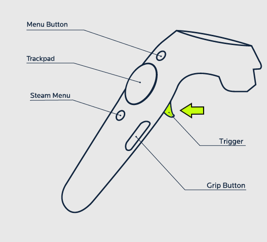
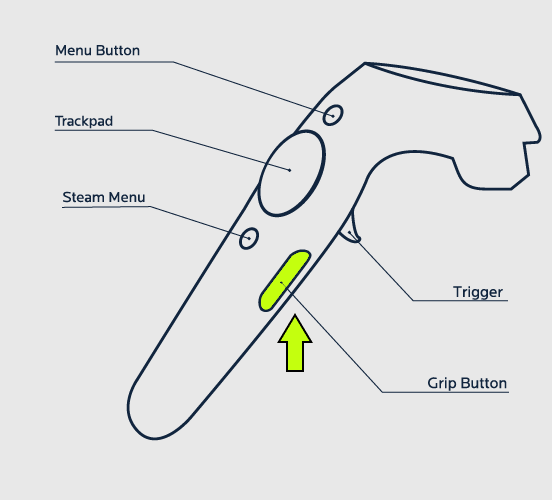
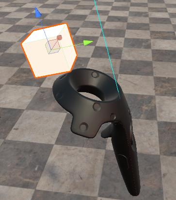
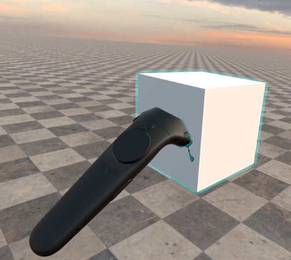
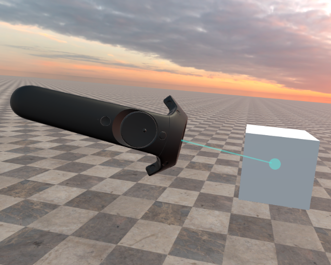

[[[Переключить на
русский]{.underline}](https://docs.google.com/document/d/1wofkNbrO0Rv2UHWv5kRNKue_l9qTOJhCuKwgAxq31KI)]{dir="ltr"}

[]{dir="ltr"}

[Contents]{dir="ltr"}

[[[Method for pressing trigger
(Use)]{.underline}](#method-for-pressing-trigger-use)]{dir="ltr"}

[[[Method for releasing
trigger]{.underline}](#method-for-releasing-trigger)]{dir="ltr"}

[[[Method for pressing Grip button (Start of
dragging)]{.underline}](#method-for-pressing-grip-button-start-of-dragging)]{dir="ltr"}

[[[Method for releasing Grip button (End of
dragging)]{.underline}](#method-for-releasing-grip-button-end-of-dragging)]{dir="ltr"}

[[[Object in hand
position]{.underline}](#object-in-hand-position)]{dir="ltr"}

[[[Method for controller entering object (Touching object with
controller)]{.underline}](#method-for-controller-entering-object-touching-object-with-controller)]{dir="ltr"}

[[[Method for controller exiting object (End of
touch)]{.underline}](#method-for-controller-exiting-object-end-of-touch)]{dir="ltr"}

[[[Method for clicking on object with
pointer]{.underline}](#method-for-clicking-on-object-with-pointer)]{dir="ltr"}

[[[Method for controller pointer entering object
area]{.underline}](#method-for-controller-pointer-entering-object-area)]{dir="ltr"}

[[[Method for controller pointer exiting object
area]{.underline}](#method-for-controller-pointer-exiting-object-area)]{dir="ltr"}

[[[Subscription for mode switch (Edit, Preview,
View)]{.underline}](#subscription-for-mode-switch-edit-preview-view)]{dir="ltr"}

[Method for pressing trigger (Use)]{dir="ltr"}
==============================================

{width="2.346826334208224in"
height="2.1287193788276464in"}[]{dir="ltr"}

[public interface IUseStartAware]{dir="ltr"}

[{]{dir="ltr"}

[//Controller interacting with object]{dir="ltr"}

[//possible to receive link to gameObject of the controller]{dir="ltr"}

[ void **OnUseStart**(UsingContext context);]{dir="ltr"}

[}]{dir="ltr"}

[Method for releasing trigger]{dir="ltr"} 
==========================================

[public interface IUseEndAware]{dir="ltr"}

[{]{dir="ltr"}

[ void **OnUseEnd**();]{dir="ltr"}

[}]{dir="ltr"}

[Method for pressing Grip button (Start of dragging)]{dir="ltr"}
================================================================

{width="2.8906255468066493in"
height="2.6246872265966754in"}[]{dir="ltr"}

[*By calling this interface, we switch on dragging of an
object*]{dir="ltr"}

[]{dir="ltr"}

[public interface IGrabStartAware]{dir="ltr"}

[{]{dir="ltr"}

[//Controller interacting with object]{dir="ltr"}

[//possible to receive link to gameObject of the controller]{dir="ltr"}

[ void **OnGrabStart**(GrabingContext context);]{dir="ltr"}

[}]{dir="ltr"}

[Method for releasing Grip button (End of dragging)]{dir="ltr"}
===============================================================

[*By calling this interface, we switch on dragging of an
object*]{dir="ltr"}

[]{dir="ltr"}

*[public interface IGrabEndAware]{dir="ltr"}*

[{]{dir="ltr"}

[ void **OnGrabEnd**();]{dir="ltr"}

[}]{dir="ltr"}

[Object in hand position]{dir="ltr"}
====================================

[Specify coordinates of the point where the controller will adhere to
object when the object is grabbed]{dir="ltr"}

{width="2.262325021872266in"
height="2.5677088801399823in"}[]{dir="ltr"}

[public interface IGrabPointAware]{dir="ltr"}

[{]{dir="ltr"}

[//left controller]{dir="ltr"}

[ Transform **GetLeftGrabPoint**();]{dir="ltr"}

[//right controller]{dir="ltr"}

[ Transform **GetRightGrabPoint**();]{dir="ltr"}

[}]{dir="ltr"}

[Method for controller entering object (Touching object with controller)]{dir="ltr"}
====================================================================================

{width="2.5364588801399823in"
height="2.2760181539807522in"}[]{dir="ltr"}

[public interface ITouchStartAware]{dir="ltr"}

[{]{dir="ltr"}

[ void **OnTouchStart**();]{dir="ltr"}

[}]{dir="ltr"}

[Method for controller exiting object (End of touch)]{dir="ltr"}
================================================================

[public interface ITouchEndAware]{dir="ltr"}

[{]{dir="ltr"}

[ void **OnTouchEnd**();]{dir="ltr"}

[}]{dir="ltr"}

[Method for clicking on object with pointer]{dir="ltr"}
=======================================================

{width="3.9144017935258093in"
height="3.1406255468066493in"}[]{dir="ltr"}

[public interface IPointerClickAware]{dir="ltr"}

[{]{dir="ltr"}

[ void **OnPointerClick**();]{dir="ltr"}

[}]{dir="ltr"}

[Method for controller pointer entering object area]{dir="ltr"}
===============================================================

[public interface IPointerInAware]{dir="ltr"}

[{]{dir="ltr"}

[ void **OnPointerIn**();]{dir="ltr"}

[}]{dir="ltr"}

[Method for controller pointer exiting object area]{dir="ltr"}
==============================================================

[public interface IPointerOutAware]{dir="ltr"}

[{]{dir="ltr"}

[ void **OnPointerOut**();]{dir="ltr"}

[}]{dir="ltr"}

[Subscription for mode switch (Edit, Preview, View)]{dir="ltr"}
===============================================================

[public interface ISwitchModeSubscriber]{dir="ltr"}

[{]{dir="ltr"}

[//mode before - mode after]{dir="ltr"}

[ void **OnSwitchMode**(GameMode newMode, GameMode oldMode);]{dir="ltr"}

[}]{dir="ltr"}

[]{dir="ltr"}

[]{dir="ltr"}
