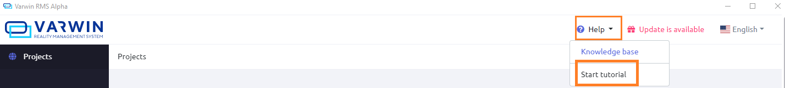

[[[Переключить на
русский]{.underline}](https://docs.google.com/document/d/1UgMMTjmzMyhDMI7iOXjYhQEAM5HYJoOZIBrdi2ntCqY)]{dir="ltr"}

[Contents]{dir="ltr"}

[[[Administrator]{.underline}](#administrator)]{dir="ltr"}

> [[[Instructions and related
> documents]{.underline}](#instructions-and-related-documents)]{dir="ltr"}

[[[Creator of objects & scene
templates]{.underline}](#creator-of-objects-scene-templates)]{dir="ltr"}

> [[[Instructions and related
> documents]{.underline}](#instructions-and-related-documents-1)]{dir="ltr"}

[[[Project creator]{.underline}](#project-creator)]{dir="ltr"}

> [[[Instructions and related
> documents]{.underline}](#instructions-and-related-documents-2)]{dir="ltr"}

[[[End-user]{.underline}](#end-user)]{dir="ltr"}

> [[[Instructions and related
> documents]{.underline}](#instructions-and-related-documents-3)]{dir="ltr"}

[]{dir="ltr"}

[Administrator]{dir="ltr"}
==========================

[*(currently, this function can be carried out by any user)*]{dir="ltr"}

-   [Installs and launches Varwin platform]{dir="ltr"}

[Instructions and related documents]{dir="ltr"}
-----------------------------------------------

[[[Varwin installation and
launch]{.underline}](https://drive.google.com/open?id=154fkmOUdvtJHYM0NmCNBLEfukRp2kzetg4Zc6PGXNBE)]{dir="ltr"}

[[[Equipment and system requirements for Varwin
platform]{.underline}](https://docs.google.com/document/d/1YnVCUts-NDuexkL_8lpMPlc_u6LR5m7oym-3rylly-g)]{dir="ltr"}

[[[Roles and functions of Varwin
users]{.underline}](https://docs.google.com/document/d/1ZPUuc5oxc4WhBYsqIWoD070IXqvT9DzpO5ZEOGKF9Zk)]{dir="ltr"}

[[[FAQ]{.underline}](https://drive.google.com/open?id=1C0YLWehIRsEa1_FQLs9cR_uQ9UReMQ2B8Wcd7WJY3f8)]{dir="ltr"}

[Creator of objects & scene templates]{dir="ltr"} 
==================================================

*[(most likely, a Unity programmer)]{dir="ltr"}*

-   [Creates objects and scene templates out of ready-made prefabs in
    > Unity]{dir="ltr"}

-   [Writes logic of their interaction]{dir="ltr"}

-   [Makes Blockly blocks for the objects]{dir="ltr"}

[Instructions and related documents]{dir="ltr"}
-----------------------------------------------

[[[Varwin
SDK]{.underline}](https://drive.google.com/open?id=1p0nfwNZRvvWYq2aG9HXmGROw-v8HBkZ5X2kDeyAKwp4)]{dir="ltr"}

[[[Creating objects for Varwin in
Unity]{.underline}](https://docs.google.com/document/d/1hsiaY3RPNxpEiCmi49X1WuThOj3C-a0yksD43CJXfFc)]{dir="ltr"}

[[[Creating scene templates for Varwin in
Unity]{.underline}](https://docs.google.com/document/d/1DkWAgLJBCicHl8lVV0bzDWR-fmC9SKqAuKRay6ja9BE)]{dir="ltr"}

[[[Uploading content into Varwin library from
Unity]{.underline}](https://docs.google.com/document/d/1mvkpk0t4nBP0NpLNd2PJF2Qnd50U_8rKKRfS_74dEEs)]{dir="ltr"}

[[[Creating libraries with shared
code]{.underline}](https://docs.google.com/document/d/1CR4Gv82DdOQaPDJdPPhMyUL5ulUO7vOX2BLG0XSsWcc)]{dir="ltr"}

[[[Public
interfaces]{.underline}](https://docs.google.com/document/d/1IW4qTlWNJSrS06jKD5ASJxVkK0wSmA_xFskRUNj1BBM)]{dir="ltr"}

[[[FAQ]{.underline}](https://drive.google.com/open?id=1nFkmWVYxjEHAd8lg3hw0oOnx_vBmHMJBziBYwffnZ0U)]{dir="ltr"}

[Project creator]{dir="ltr"}
============================

-   [Uploads new objects and scene templates to the library]{dir="ltr"}

-   [Creates and edits projects]{dir="ltr"}

-   [Creates project scenario using objects and scene templates from the
    > library and blocks in Blockly]{dir="ltr"}

-   [Shapes up requirements for the new objects and Blockly blocks, or
    > selects from ready ones.]{dir="ltr"}

[Instructions and related documents]{dir="ltr"}
-----------------------------------------------

[[[Varwin platform: general
information]{.underline}](https://docs.google.com/document/d/1T840LvW5hMn4BTiyWYsUDwVDCJV_7j4sRIHqoZ7btqQ)]{dir="ltr"}

[[[Varwin RMS
App]{.underline}](https://docs.google.com/document/d/1LOg1Ts-gDaG43nlDBW80sas961XDlgt1dFUqQe9Ntx8)]{dir="ltr"}

[[[Using VR
controllers]{.underline}](https://docs.google.com/document/d/103KShWrxmJBIRwkcPeKaJNXoTDSB_9Ov_1iI8LjbtI4)]{dir="ltr"}

[[[Creating VR
projects]{.underline}](https://docs.google.com/document/d/1ji8IlKHhGR5aJDMzmPGu1I-DVEx0i7xq8PQAft2oDqo)]{dir="ltr"}

[[[Working with
Blockly]{.underline}](https://docs.google.com/document/d/1J6C6y2byfLWf3ojLXNg2hGarLVvGczTvG4e_aG42Hi4)]{dir="ltr"}

[[[FAQ]{.underline}](https://drive.google.com/open?id=1C0YLWehIRsEa1_FQLs9cR_uQ9UReMQ2B8Wcd7WJY3f8)]{dir="ltr"}

[Varwin RMS tutorial]{dir="ltr"}

{width="10.015748031496063in"
height="1.1388888888888888in"}[]{dir="ltr"}

[End-user]{dir="ltr"}
=====================

-   [Launches end product (an app built out of VR project) from Varwin
    > interface or from .exe file]{dir="ltr"}

-   [Interacts with the end product]{dir="ltr"}

[Instructions and related documents]{dir="ltr"}
-----------------------------------------------

[[[Equipment and system requirements for Varwin
platform]{.underline}](https://docs.google.com/document/d/1YnVCUts-NDuexkL_8lpMPlc_u6LR5m7oym-3rylly-g)]{dir="ltr"}

[[[Using VR
controllers]{.underline}](https://docs.google.com/document/d/103KShWrxmJBIRwkcPeKaJNXoTDSB_9Ov_1iI8LjbtI4)]{dir="ltr"}

[[[Varwin RMS
App]{.underline}](https://docs.google.com/document/d/1LOg1Ts-gDaG43nlDBW80sas961XDlgt1dFUqQe9Ntx8)]{dir="ltr"}

[[[FAQ]{.underline}](https://drive.google.com/open?id=1C0YLWehIRsEa1_FQLs9cR_uQ9UReMQ2B8Wcd7WJY3f8)]{dir="ltr"}
