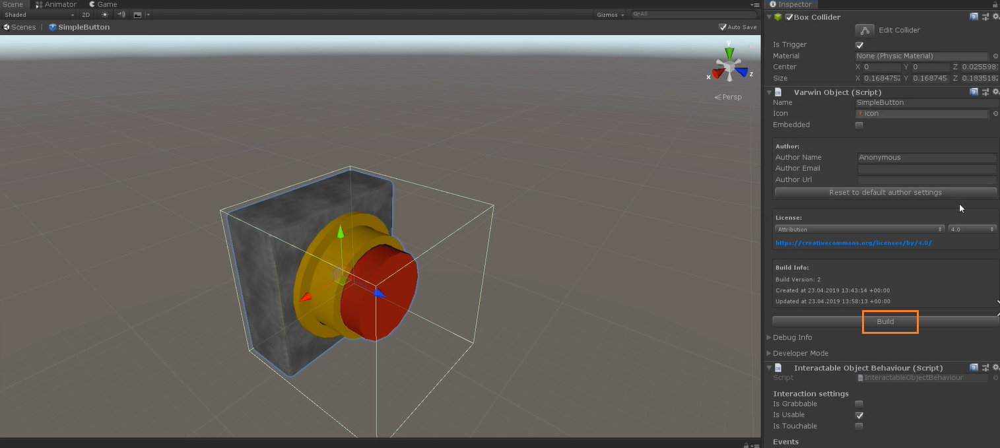
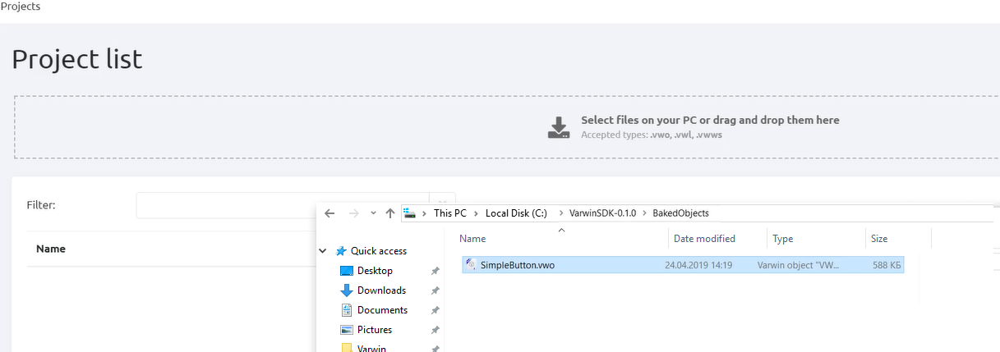
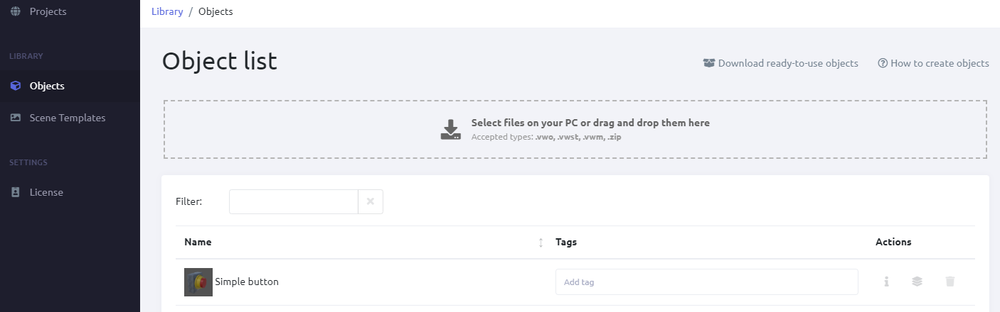
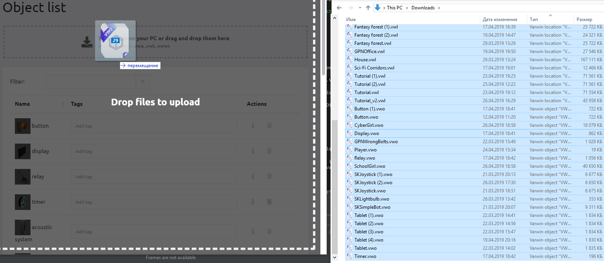
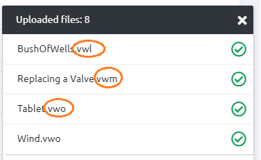

[[[Переключить на
русский]{.underline}](https://docs.google.com/document/d/17CKZ5dYyO-mgdwuhf-kv7v9qGFkkgrEUyzwv6D1PSi8)]{dir="ltr"}

[ ]{dir="ltr"}

1.  [Open the object in Unity. Click Build.]{dir="ltr"}

{width="7.018824365704287in"
height="3.149721128608924in"}[]{dir="ltr"}

2.  [When the object is ready, the folder containing it will open. Open
    > Varwin RMS app and drag-and-drop the object into the
    > library.]{dir="ltr"}

{width="6.831324365704287in"
height="2.4127252843394578in"}[]{dir="ltr"}

3.  [The object appeared in the library]{dir="ltr"}

{width="8.029241032370953in"
height="2.512267060367454in"} [ ]{dir="ltr"}

4.  [You can perform bulk upload]{dir="ltr"}

{width="8.397182852143482in"
height="3.6635903324584427in"}[]{dir="ltr"}

5.  [You can simultaneously upload different types of files: objects
    > (.vwo files,) scene templates (.vwst,) metadata (.vwm). You can
    > also upload zip archives with files.]{dir="ltr"}

{width="3.435489938757655in"
height="2.1014971566054244in"}[]{dir="ltr"}

[]{dir="ltr"}
