[[[Переключить на
русский]{.underline}](https://docs.google.com/document/d/1Rdx0wPDI8pDRWhKYmDF_w4OefUSKc5qWwZzO9NZ0INM)]{dir="ltr"}

[]{dir="ltr"}

[Contents]{dir="ltr"}

[[[Equipment]{.underline}](#equipment)]{dir="ltr"}

[[[HTC Vive controllers]{.underline}](#htc-vive-controllers)]{dir="ltr"}

> [[[Grab object]{.underline}](#grab-object)]{dir="ltr"}
>
> [[[Action]{.underline}](#action)]{dir="ltr"}
>
> [[[Teleportation]{.underline}](#teleportation)]{dir="ltr"}
>
> [[[Turn]{.underline}](#turn)]{dir="ltr"}
>
> [[[Menu]{.underline}](#menu)]{dir="ltr"}
>
> [[[Also]{.underline}](#also)]{dir="ltr"}

[[[Oculus controllers]{.underline}](#oculus-controllers)]{dir="ltr"}

> [[[Grab object]{.underline}](#grab-object-1)]{dir="ltr"}
>
> [[[Action]{.underline}](#action-1)]{dir="ltr"}
>
> [[[Teleportation]{.underline}](#teleportation-1)]{dir="ltr"}
>
> [[[Turn]{.underline}](#turn-1)]{dir="ltr"}
>
> [[[Menu]{.underline}](#menu-1)]{dir="ltr"}
>
> [[[Also]{.underline}](#also-1)]{dir="ltr"}

[[[WMR controllers]{.underline}](#wmr-controllers)]{dir="ltr"}

> [[[Grab object]{.underline}](#grab-object-2)]{dir="ltr"}
>
> [[[Action]{.underline}](#action-2)]{dir="ltr"}
>
> [[[Teleportation]{.underline}](#teleportation-2)]{dir="ltr"}
>
> [[[Turn]{.underline}](#turn-2)]{dir="ltr"}
>
> [[[Menu]{.underline}](#menu-2)]{dir="ltr"}
>
> [[[Also]{.underline}](#also-2)]{dir="ltr"}

[[[Further reading]{.underline}](#further-reading)]{dir="ltr"}

[]{dir="ltr"}

[]{dir="ltr"}

[]{dir="ltr"}

[]{dir="ltr"}

[]{dir="ltr"}

[]{dir="ltr"}

[]{dir="ltr"}

[]{dir="ltr"}

[Equipment]{dir="ltr"} 
=======================

[Varwin platform can be managed with the following
controllers:]{dir="ltr"}

-   **[HTC Vive]{dir="ltr"}**

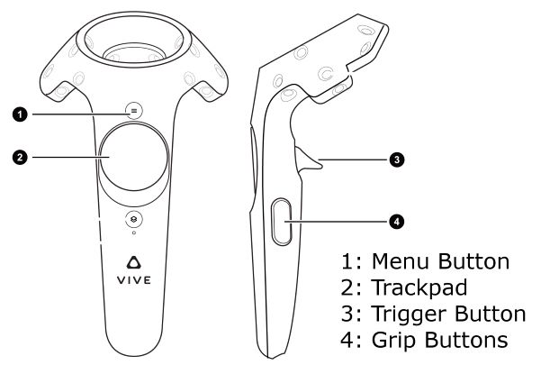{width="4.7327985564304464in"
height="3.278173665791776in"}[]{dir="ltr"}

-   **[Oculus]{dir="ltr"}**

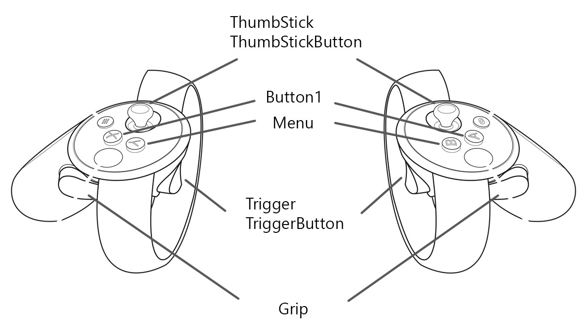{width="4.685489938757655in"
height="2.652004593175853in"}[]{dir="ltr"}

-   [**Windows Mixed Reality (WMR)** *(any manufacturer)*]{dir="ltr"}

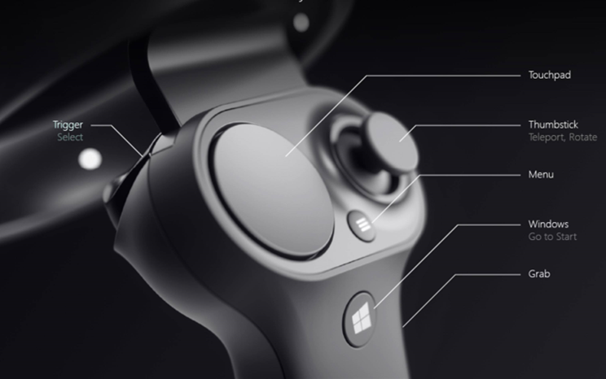{width="5.102156605424322in"
height="3.196068460192476in"}[]{dir="ltr"}

[HTC Vive controllers]{dir="ltr"}
=================================

[Grab object]{dir="ltr"}
------------------------

-   [Press Grip]{dir="ltr"}

-   [To carry the grabbed object:]{dir="ltr"}

    -   [Preview, View mode: Hold down Grip button]{dir="ltr"}

    -   [Edit mode: No need to hold down Grip button]{dir="ltr"}

-   [To put the object down:]{dir="ltr"}

    -   [Preview, View mode: Release Grip button]{dir="ltr"}

    -   [Edit mode: Press Trigger button]{dir="ltr"}

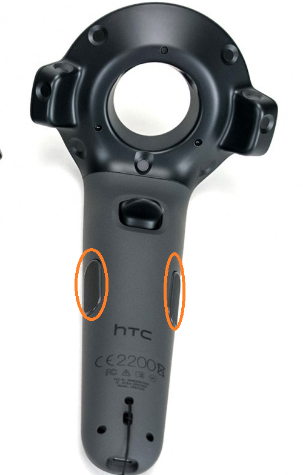{width="1.9979899387576554in"
height="3.1396992563429573in"}[]{dir="ltr"}

[Action]{dir="ltr"}
-------------------

-   [Press Trigger]{dir="ltr"}

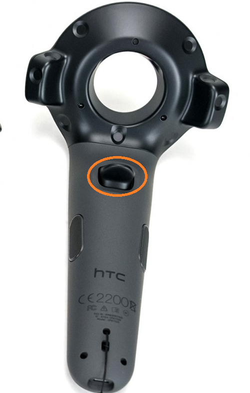{width="2.114483814523185in"
height="3.3198403324584427in"}[]{dir="ltr"}

[Teleportation]{dir="ltr"}
--------------------------

-   [Press the **central area** of trackpad.]{dir="ltr"}

-   [The pointer will appear. While holding down the trackpad, point the
    > ray to the area where you need to teleport to. If the ray is
    > colored green, teleportation is possible.]{dir="ltr"}

-   [For teleportation, release the trackpad.]{dir="ltr"}

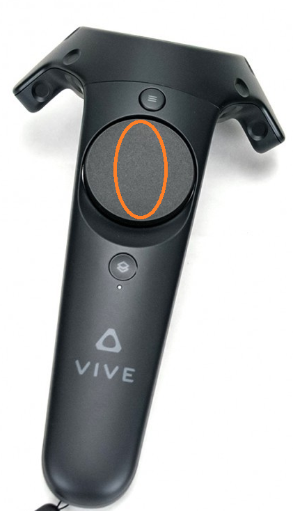{width="2.070906605424322in"
height="3.610812554680665in"}[]{dir="ltr"}

[Turn]{dir="ltr"}
-----------------

-   [Press the left side of the trackpad for an incremental turn to the
    > left, right side - for an incremental turn to the
    > right.]{dir="ltr"}

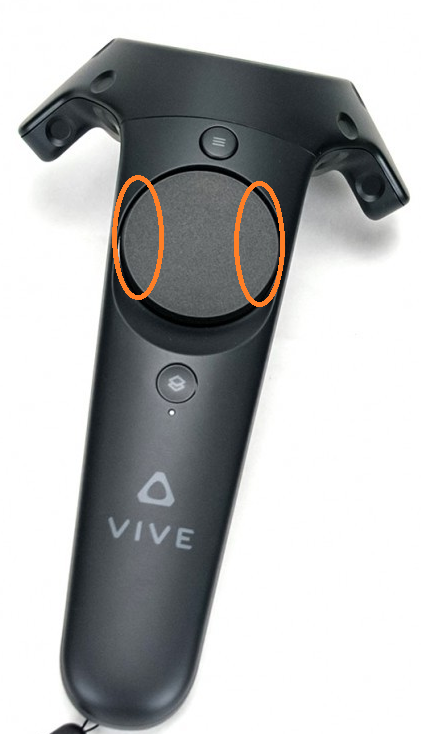{width="2.0500732720909887in"
height="3.5747517497812775in"}[]{dir="ltr"}

[Menu]{dir="ltr"}
-----------------

-   [Menu button on the **left** controller:]{dir="ltr"}

    -   [Edit mode: press to display menu, press again to exit
        > menu]{dir="ltr"}

    -   [Preview mode: displays button for switching to Edit
        > mode.]{dir="ltr"}

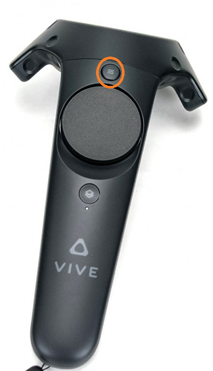{width="2.008406605424322in"
height="3.51748687664042in"}[]{dir="ltr"}

[Also]{dir="ltr"} 
------------------

-   [System button displays Vive system menu (unconnected to Varwin
    > platform)]{dir="ltr"}

-   [If pressed by mistake: press again to get back.]{dir="ltr"}

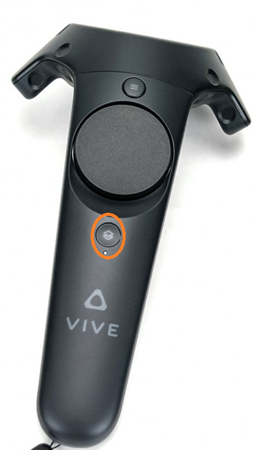{width="1.5813232720909887in"
height="2.758332239720035in"}[]{dir="ltr"}

[Oculus controllers]{dir="ltr"}
===============================

[Grab object]{dir="ltr"}
------------------------

-   [Press Grip]{dir="ltr"}

-   [To carry the grabbed object:]{dir="ltr"}

    -   [Preview, View mode: Hold down Grip button]{dir="ltr"}

    -   [Edit mode: No need to hold down Grip button]{dir="ltr"}

-   [To put the object down:]{dir="ltr"}

    -   [Preview, View mode: Release Grip button]{dir="ltr"}

    -   [Edit mode: Press Trigger button]{dir="ltr"}

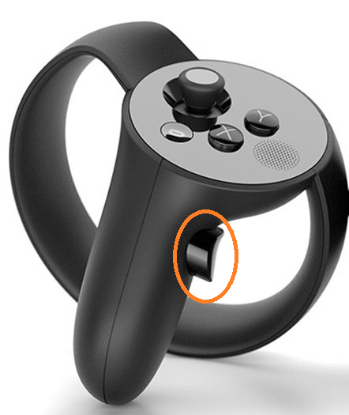{width="2.1405916447944007in"
height="2.538591426071741in"}[]{dir="ltr"}

[Action]{dir="ltr"}
-------------------

-   [Press Trigger]{dir="ltr"}

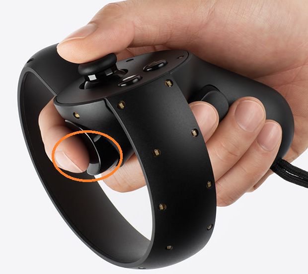{width="1.8625732720909887in"
height="1.660120297462817in"}[]{dir="ltr"}

[Teleportation]{dir="ltr"}
--------------------------

-   [Press Thumbstick.]{dir="ltr"}

-   [The pointer will appear. While holding down the thumbstick, point
    > the ray to the area where you need to teleport to. If the ray is
    > colored green, teleportation is possible.]{dir="ltr"}

-   [For teleportation, release the thumbstick.]{dir="ltr"}

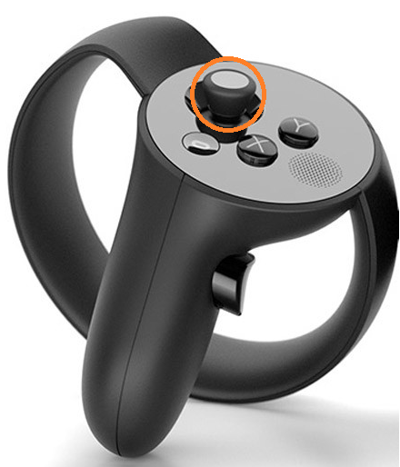{width="1.8000732720909887in"
height="2.103700787401575in"}[]{dir="ltr"}

[Turn]{dir="ltr"}
-----------------

-   [Press thumbstick leftward for an incremental turn to the left,
    > rightward - for an incremental turn to the right.]{dir="ltr"}

{width="1.820906605424322in"
height="2.122596237970254in"}[]{dir="ltr"}

[Menu]{dir="ltr"}
-----------------

-   [Y button (left controller) displays the menu.]{dir="ltr"}

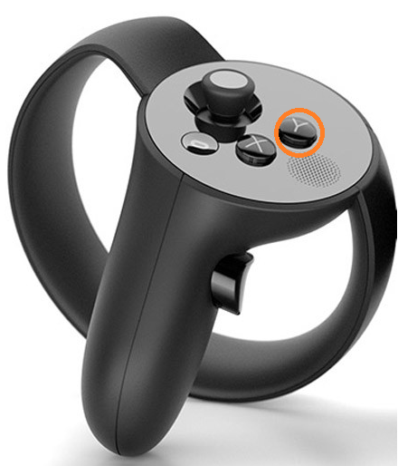{width="1.9620844269466318in"
height="2.299008092738408in"}[]{dir="ltr"}

[Also]{dir="ltr"} 
------------------

-   [System button displays Oculus system menu (unconnected to Varwin
    > platform)]{dir="ltr"}

-   [If pressed by mistake: press again to get back.]{dir="ltr"}

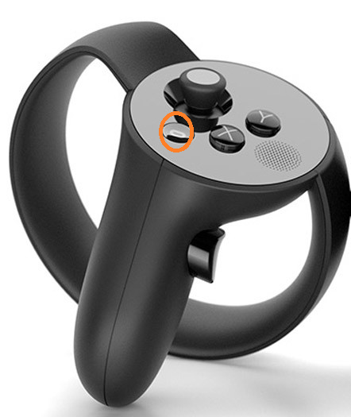{width="1.9875732720909887in"
height="2.3608748906386703in"}[]{dir="ltr"}

[WMR controllers]{dir="ltr"}
============================

[Grab object]{dir="ltr"}
------------------------

-   [Press Grab]{dir="ltr"}

    -   [To carry the grabbed object:]{dir="ltr"}

        -   [Preview, View mode: Hold down Grab button]{dir="ltr"}

        -   [Edit mode: No need to hold down Grab button]{dir="ltr"}

    -   [To put the object down:]{dir="ltr"}

        -   [Preview, View mode: Release Grab button]{dir="ltr"}

        -   [Edit mode: Press Trigger button]{dir="ltr"}

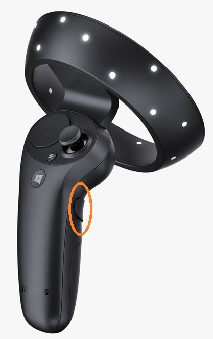{width="1.9979899387576554in"
height="3.1924409448818896in"}[]{dir="ltr"}

[Action]{dir="ltr"}
-------------------

-   [Press Trigger]{dir="ltr"}

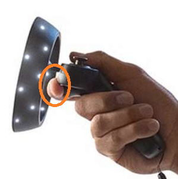{width="2.3313232720909887in"
height="2.354520997375328in"}[]{dir="ltr"}

[Teleportation]{dir="ltr"}
--------------------------

-   [Press the **central area** of the touchpad.]{dir="ltr"}

-   [The pointer will appear. While holding down the touchpad, point the
    > ray to the area where you need to teleport to. If the ray is
    > colored green, teleportation is possible.]{dir="ltr"}

-   [For teleportation, release the touchpad.]{dir="ltr"}

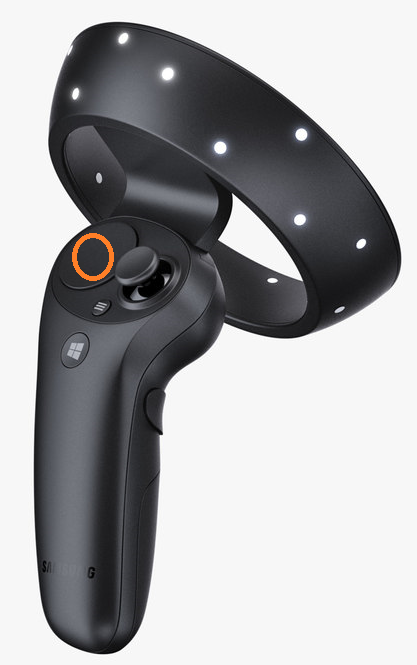{width="1.9508300524934383in"
height="3.080256999125109in"}[]{dir="ltr"}

[Turn]{dir="ltr"}
-----------------

-   [Press the left side of the touchpad for an incremental turn to the
    > left, right side - for an incremental turn to the
    > right.]{dir="ltr"}

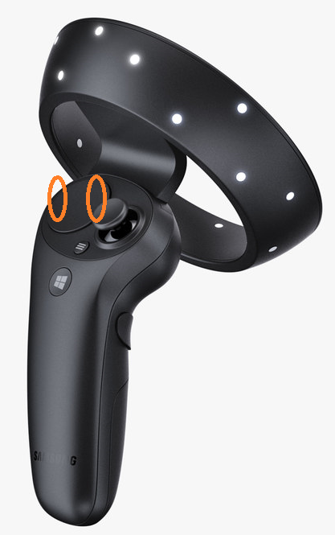{width="1.8634820647419073in"
height="2.986506999125109in"}[]{dir="ltr"}

[Menu]{dir="ltr"}
-----------------

-   [Menu button on the **left** controller:]{dir="ltr"}

    -   [Edit mode: press to display menu, press again to exit
        > menu,]{dir="ltr"}

    -   [Preview mode: displays button for switching to Edit
        > mode.]{dir="ltr"}

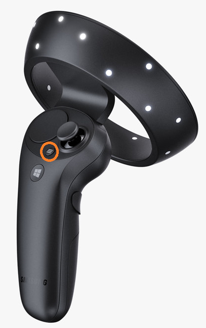{width="1.8417399387576554in"
height="2.9657436570428697in"}[]{dir="ltr"}

[Also]{dir="ltr"}
-----------------

-   [System button displays the Windows system menu (unconnected to
    > Varwin platform)]{dir="ltr"}

-   [If pressed by mistake: press again to get back.]{dir="ltr"}

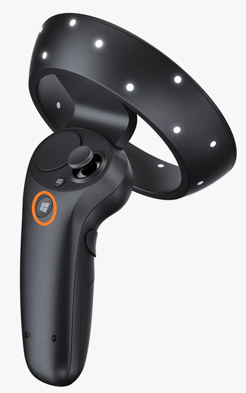{width="1.8729899387576554in"
height="2.9873009623797024in"}[]{dir="ltr"}

[Further reading]{dir="ltr"}
============================

[[[About the VIVE controllers
(vive.com)]{.underline}](https://www.vive.com/us/support/vive/category_howto/about-the-controllers.html)]{dir="ltr"}

[[[Controllers in Windows Mixed Reality
(support.microsoft.com)]{.underline}](https://support.microsoft.com/en-us/help/4040517/windows-10-controllers-windows-mixed-reality)]{dir="ltr"}
