[[[Переключить на
русский]{.underline}](https://docs.google.com/document/d/1qUOCfSM6VqKuQ4G0bUbm70xKtfEEc-wx8Ij9mdMstNE/edit#)]{dir="ltr"}

[]{dir="ltr"}

[Contents]{dir="ltr"}

[[[App modes]{.underline}](#app-modes)]{dir="ltr"}

> [[[Edit mode]{.underline}](#edit-mode)]{dir="ltr"}
>
> [[[Editing in VR]{.underline}](#editing-in-vr)]{dir="ltr"}
>
> [[[Editing without VR: Desktop
> Editor]{.underline}](#editing-without-vr-desktop-editor)]{dir="ltr"}
>
> [[[Creating the project
> scenario]{.underline}](#creating-the-project-scenario)]{dir="ltr"}
>
> [[[Code editing]{.underline}](#code-editing)]{dir="ltr"}
>
> [[[Preview mode]{.underline}](#preview-mode)]{dir="ltr"}
>
> [[[View mode]{.underline}](#view-mode)]{dir="ltr"}

[[[Library]{.underline}](#library)]{dir="ltr"}

> [[[Project structures]{.underline}](#project-structures)]{dir="ltr"}
>
> [[[Scene templates and
> objects]{.underline}](#scene-templates-and-objects)]{dir="ltr"}
>
> [[[Versioning of scene templates and
> objects]{.underline}](#versioning-of-scene-templates-and-objects)]{dir="ltr"}
>
> [[[Tags]{.underline}](#tags)]{dir="ltr"}
>
> [[[Files for
> export/import]{.underline}](#files-for-exportimport)]{dir="ltr"}

[[[End product]{.underline}](#end-product)]{dir="ltr"}

[Varwin app is the environment for creating and editing VR
projects.]{dir="ltr"}

[Varwin app is installed on computers of everyone participating in a
project.]{dir="ltr"}

[App modes]{dir="ltr"}
======================

[Edit mode]{dir="ltr"}
----------------------

### **[Editing in VR]{dir="ltr"}**

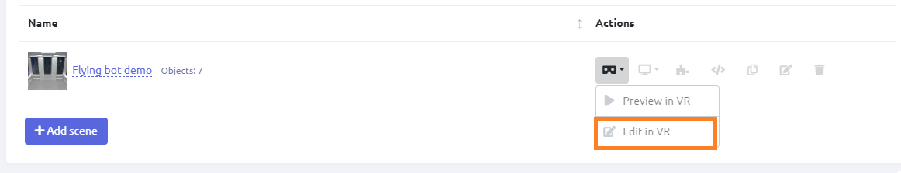{width="10.713664698162729in"
height="2.0694444444444446in"}[]{dir="ltr"}

-   [Edit mode in VR is used to spawn objects on the scene]{dir="ltr"}

-   [In Edit Mode, physical laws do not affect objects. They are applied
    > in Preview and View modes.]{dir="ltr"}

### [Editing without VR: Desktop Editor]{dir="ltr"}

[Use your mouse and keyboard to edit VR scenes. The Desktop Editor
feature allows editing without VR, namely place objects on the scene and
set their positions. To use this feature, click "Edit on
desktop."]{dir="ltr"}

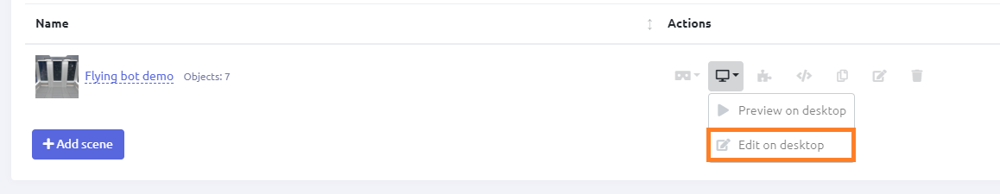{width="10.015748031496063in"
height="1.9444444444444444in"}[]{dir="ltr"}

[*Learn more:* [[Adding objects without VR (Desktop
editor)]{.underline}](https://docs.google.com/document/d/1ji8IlKHhGR5aJDMzmPGu1I-DVEx0i7xq8PQAft2oDqo/edit#heading=h.ek19qlqc8jx6)]{dir="ltr"}

### [Creating the project scenario]{dir="ltr"} 

[Project scenario and logic are created in Blockly visual editor. No
programming skills are required.]{dir="ltr"}

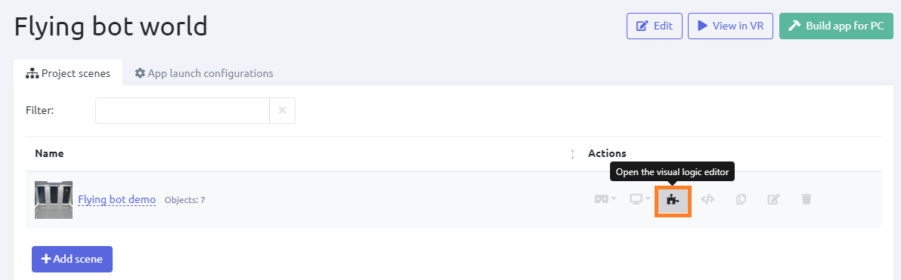{width="10.65625in"
height="2.7244094488188977in"}[]{dir="ltr"}

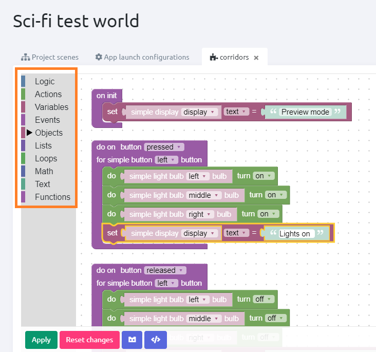{width="3.9354910323709538in"
height="3.680903324584427in"}[]{dir="ltr"}

[*Working with Blockly:*
[[Manual]{.underline}](https://drive.google.com/open?id=1J6C6y2byfLWf3ojLXNg2hGarLVvGczTvG4e_aG42Hi4)]{dir="ltr"}

-   [All necessary logic blocks are provided]{dir="ltr"}

-   [Users can create and name necessary variables]{dir="ltr"}

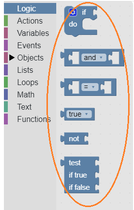{width="1.7959503499562555in"
height="2.799006999125109in"}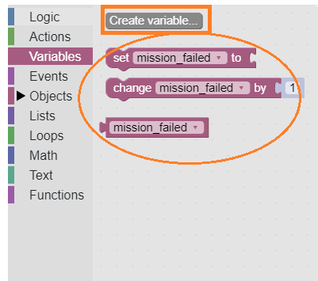{width="2.9771576990376203in"
height="2.639746281714786in"}[]{dir="ltr"}

[*Pre-provided logic blocks Variables creation option; custom
variables*]{dir="ltr"}

### [Code editing]{dir="ltr"}

[If necessary, the user can edit the code of the project.]{dir="ltr"}

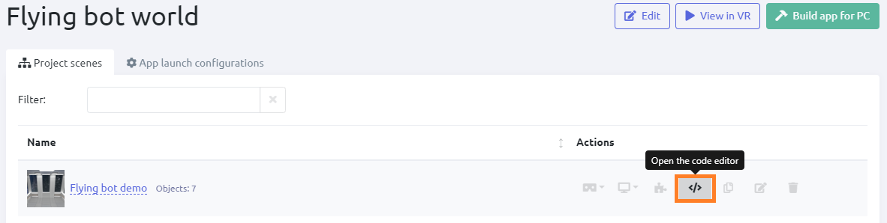{width="9.581324365704287in"
height="2.409907042869641in"}[]{dir="ltr"}

[Preview mode]{dir="ltr"}
-------------------------

-   [You can preview your project in VR or in Desktop
    > Editor.]{dir="ltr"}

-   [Physical laws are applied to objects\*.]{dir="ltr"}

-   [The objects engage in the preset logic (e.g., a display shows
    > specific text when specific conditions are met.)]{dir="ltr"}

{width="10.713664698162729in" height="2.0694444444444446in"}[]{dir="ltr"}
---------------------------------------------------------------------------------------------------------------

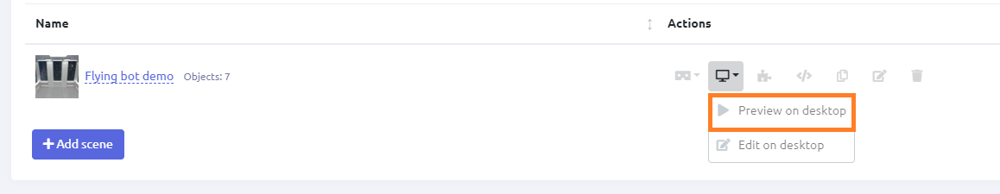{width="10.713664698162729in"
height="2.0833333333333335in"}[]{dir="ltr"}

[\* Those objects which have been assigned relevant parameter when
created]{dir="ltr"}

[View mode]{dir="ltr"}
----------------------

[View mode switches on when a user runs the ready app. Also, this mode
can be entered by clicking View In VR button.]{dir="ltr"}

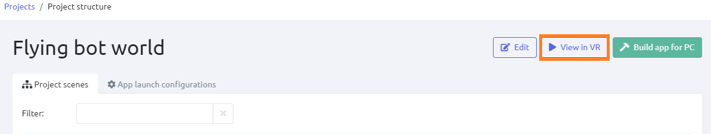{width="10.713664698162729in"
height="2.0277777777777777in"}[]{dir="ltr"}

[View mode can be switched on if the project has at least one
configuration.]{dir="ltr"}

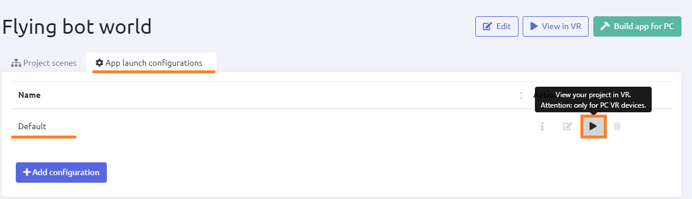{width="10.713664698162729in"
height="3.0972222222222223in"}[]{dir="ltr"}

[*Learn more:* [[App launch configurations and
view]{.underline}](https://docs.google.com/document/d/1ji8IlKHhGR5aJDMzmPGu1I-DVEx0i7xq8PQAft2oDqo/edit#heading=h.32bbtxuwhe4q)]{dir="ltr"}

-   [Physical laws are applied to all objects.]{dir="ltr"}

-   [View mode doesn't allow to switch to Edit mode, nor to make any
    > editing.]{dir="ltr"}

-   [Interaction with configuration (ready-made virtual world) following
    > a preset script.]{dir="ltr"}

[]{dir="ltr"}

[See also: [[VR menu
functions]{.underline}](https://docs.google.com/document/d/1ji8IlKHhGR5aJDMzmPGu1I-DVEx0i7xq8PQAft2oDqo/edit#heading=h.tyjcwt)]{dir="ltr"}

[Library]{dir="ltr"}
====================

[Varwin app provides the user with a library storing the
following:]{dir="ltr"}

-   [project settings,]{dir="ltr"}

-   [project metadata,]{dir="ltr"}

-   [scene templates to create scenarios in,]{dir="ltr"}

-   [objects to set in the scene templates.]{dir="ltr"}

[Varwin allows users to create new objects and scene templates and
upload them to the library. This will require Varwin SDK - development
tools tailored for Varwin platform and provided in the packaged
solution.]{dir="ltr"}

[*Learn more:* [[Varwin
SDK]{.underline}](https://docs.google.com/document/d/1p0nfwNZRvvWYq2aG9HXmGROw-v8HBkZ5X2kDeyAKwp4)]{dir="ltr"}

[Project structures]{dir="ltr"}
-------------------------------

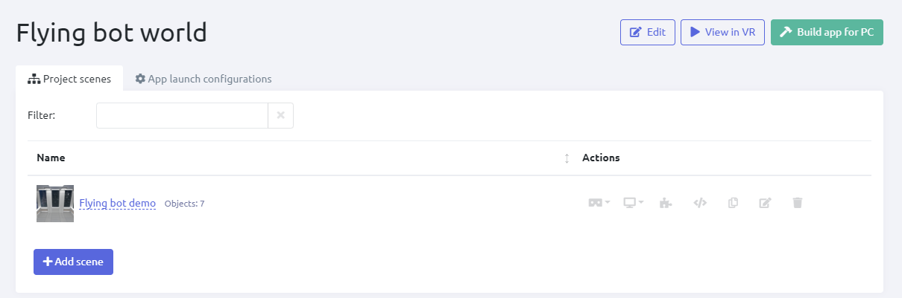{width="9.904241032370953in"
height="3.2843602362204725in"}[]{dir="ltr"}

[*Projects metadata in the library*]{dir="ltr"}

[]{dir="ltr"}

[Project metadata is a blank VR project for further editing. It contains
IDs of scene templates and objects, coordinates of objects' placement,
the logic for Blockly. This file is editable.]{dir="ltr"}

[Scene templates and objects]{dir="ltr"}
----------------------------------------

[Scene templates and objects are stored in the relevant sections of the
Library. Both their names and icons are displayed in the
list.]{dir="ltr"}

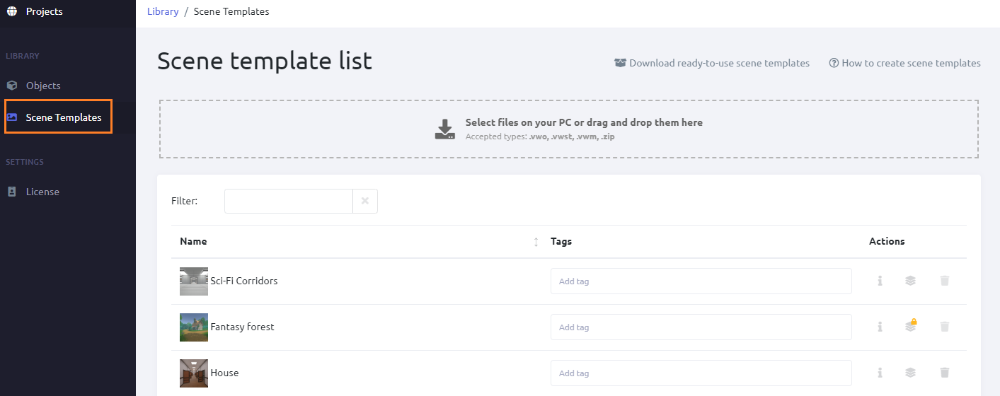{width="10.713664698162729in"
height="4.25in"}[]{dir="ltr"}

*[Scene templates in the library]{dir="ltr"}*

[]{dir="ltr"}

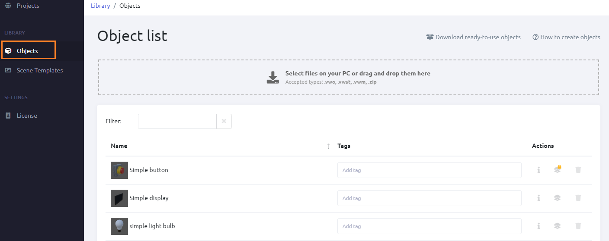{width="10.713664698162729in"
height="4.25in"}[]{dir="ltr"}

[*Objects in the library*\
]{dir="ltr"}

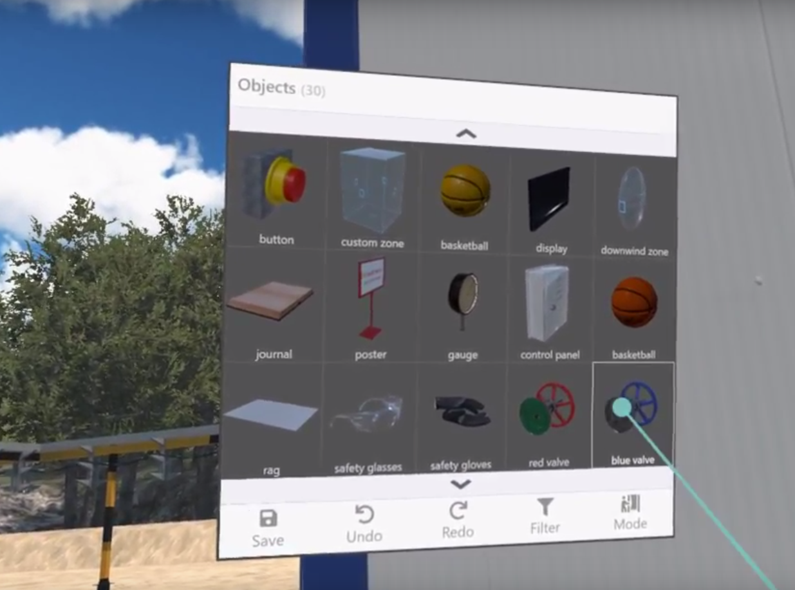{width="3.050762248468941in"
height="2.2573403324584427in"}[]{dir="ltr"}

[*Object menu in VR*]{dir="ltr"}

### **[Versioning of scene templates and objects]{dir="ltr"}**

[An object/scene template can have different versions. An RMS user can
view versions of an object/scene template by clicking the Default
Version button in the RMS.]{dir="ltr"}

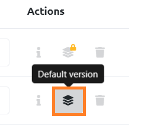{width="2.122785433070866in"
height="1.8858672353455819in"}[]{dir="ltr"}

-   [The latest version of an object/scene template is set by the system
    > as a default one.]{dir="ltr"}

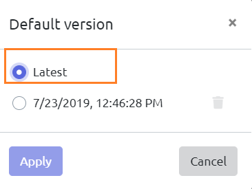{width="2.7506014873140856in"
height="2.0629505686789154in"}[]{dir="ltr"}

-   [If a user selects another version of an object/scene template as a
    > default one, a sign of a lock appears on the Default Version
    > button. It means that a user default version is selected for this
    > object/scene template.]{dir="ltr"}

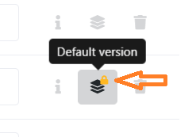{width="2.804093394575678in"
height="1.9659689413823271in"} [ ]{dir="ltr"}
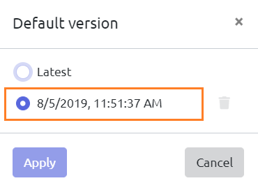{width="2.6848392388451443in"
height="1.9737193788276466in"}[]{dir="ltr"}

-   [This choice is fixed for all the projects.]{dir="ltr"}

<!-- -->

-   [If an RMS user uses a version of an object/scene template in a
    > project and then changes the default version for this object/scene
    > template in the library, the change won't affect that
    > project.]{dir="ltr"}

-   [There can be any number of versions to choose from.]{dir="ltr"}

[Tags]{dir="ltr"}
-----------------

[Tags can be assigned to objects and/or scene templates in order to
simplify their finding and systematizing.]{dir="ltr"}

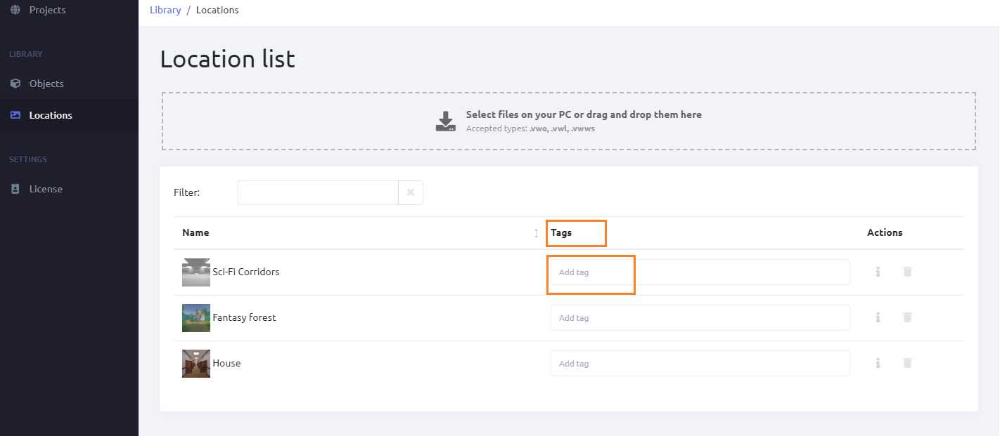{width="8.205134514435695in"
height="2.6770833333333335in"}[]{dir="ltr"}

[*Tags in the library*]{dir="ltr"}

-   [The tags assigned in the library will be displayed in
    > VR.]{dir="ltr"}

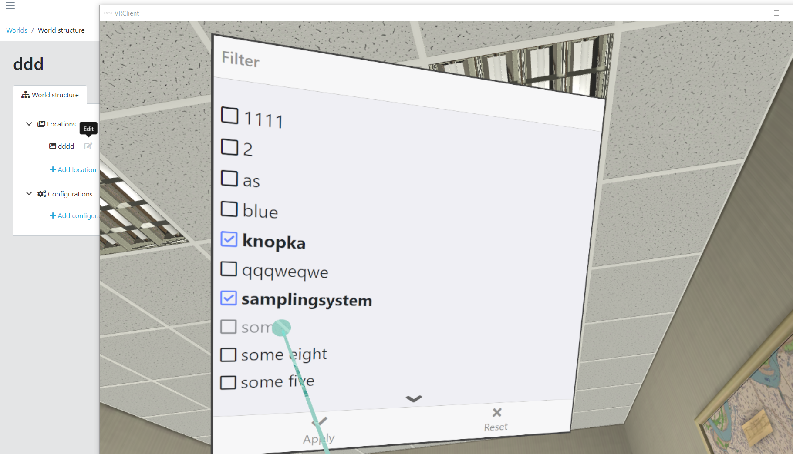{width="4.383407699037621in"
height="2.5243733595800526in"} [ ]{dir="ltr"}

[*Tags in VR*]{dir="ltr"}

-   [Tags are editable]{dir="ltr"}

-   [For tag list in VR, click Filter. The digit icon on this button
    > displays the number of tags applied.]{dir="ltr"}

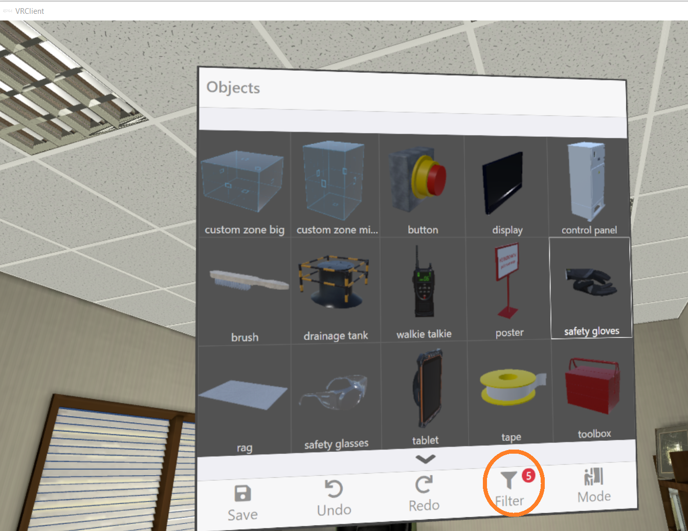{width="4.164657699037621in"
height="3.214028871391076in"}[]{dir="ltr"}

[*Tag list in VR*]{dir="ltr"}

[Files for export/import]{dir="ltr"} 
-------------------------------------

[Files containing objects, scene templates, project metadata can be
imported into the system.]{dir="ltr"}

[Project metadata and ready apps can be exported as files. Scene
templates and objects are not exportable.]{dir="ltr"}

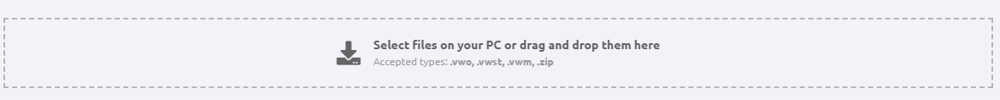{width="10.713664698162729in"
height="1.0833333333333333in"}[]{dir="ltr"}

[*Import of objects, scene templates, project metadata*]{dir="ltr"}

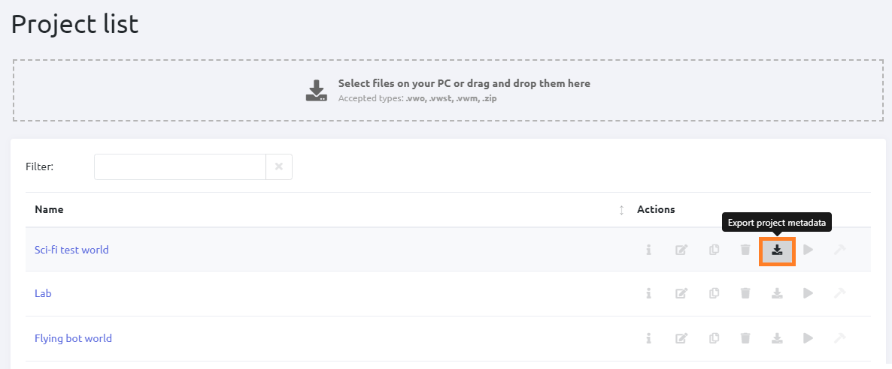{width="10.13340769903762in"
height="4.2078543307086615in"}[]{dir="ltr"}

*[Export of project metadata]{dir="ltr"}*

[End product]{dir="ltr"}
========================

[When the project is completed, an app for the end user can be built out
of it.]{dir="ltr"}

-   [The apps are exported as .exe files. They can be launched on any
    > PC.]{dir="ltr"}

-   [Varwin platform installation is not needed to launch an exported
    > app.]{dir="ltr"}

-   [The apps are not editable.]{dir="ltr"}

-   [Not available for Starter edition.]{dir="ltr"}

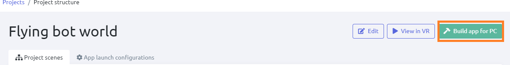{width="10.713664698162729in"
height="1.375in"}[]{dir="ltr"}

[*Build a ready app (not available for Starter edition)*]{dir="ltr"}
