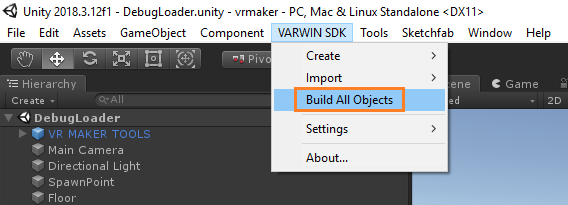

[[[Переключить на
русский]{.underline}](https://docs.google.com/document/d/1DypdjAmDuXyqFeLg7Pq66hhkEYmU0fYgVRPfgzfgwGQ/edit)]{dir="ltr"}

[Contents]{dir="ltr"}

[[[What this is]{.underline}](#what-this-is)]{dir="ltr"}

[[[Installation]{.underline}](#installation)]{dir="ltr"}

[[[Creating objects]{.underline}](#creating-objects)]{dir="ltr"}

> [[[Object file]{.underline}](#object-file)]{dir="ltr"}

[[[Creating scene
templates]{.underline}](#creating-scene-templates)]{dir="ltr"}

> [[[Scene template file]{.underline}](#scene-template-file)]{dir="ltr"}

[[[Importing models]{.underline}](#importing-models)]{dir="ltr"}

[[[Objects, scene templates
versioning]{.underline}](#objects-scene-templates-versioning)]{dir="ltr"}

[[[Bulk build of
objects]{.underline}](#bulk-build-of-objects)]{dir="ltr"}

[[[Additional materials]{.underline}](#additional-materials)]{dir="ltr"}

[]{dir="ltr"}

[What this is]{dir="ltr"}
=========================

[SDK (software development kit) is a set of development tools that
allows creating apps for certain program suite.]{dir="ltr"}

[Varwin SDK is a set of tools for creating content (objects, scene
templates) for Varwin in the Unity development platform. In order to
work with Varwin SDK,
[[Unity]{.underline}](https://unity3d.com/get-unity/download/archive?_ga=2.19733694.707766669.1553265932-456492208.1549287338)
ver. 2018.4.1f1 has to be installed on your PC.]{dir="ltr"}

[Installation]{dir="ltr"}
=========================

[Varwin SDK comes as a Unity archive file (VarwinSDK.unitypackage). The
file is attached to the letter you received while [[installing the
Varwin
RMS]{.underline}](https://docs.google.com/document/d/154fkmOUdvtJHYM0NmCNBLEfukRp2kzetg4Zc6PGXNBE/edit#heading=h.6pzhcaqjibjv).]{dir="ltr"}

[]{dir="ltr"}

-   [[[How to install the Varwin
    > SDK]{.underline}](https://drive.google.com/open?id=15_MIL6kOdS-BHaJs7M0eDz_XHCuBDrRLSxmBrYGYDlU)]{dir="ltr"}

[Creating objects]{dir="ltr"}
=============================

[Create objects for Varwin platform on Unity. Any prefab can be used as
a base for creating an object.]{dir="ltr"}

{width="6.029241032370954in"
height="1.9723906386701662in"}[]{dir="ltr"}

{width="4.070906605424322in"
height="4.842793088363955in"}[]{dir="ltr"}

-   [[[Creating Varwin objects in
    > Unity]{.underline}](https://drive.google.com/open?id=1hsiaY3RPNxpEiCmi49X1WuThOj3C-a0yksD43CJXfFc):
    > manual]{dir="ltr"}

[Object file]{dir="ltr"}
------------------------

{width="0.9544663167104112in"
height="1.0677088801399826in"}[]{dir="ltr"}

[Created objects are packed as files with name suffix .vwo. These files
can be uploaded to Varwin.]{dir="ltr"}

-   [ [[Uploading content into Varwin library from
    > Unity]{.underline}](https://drive.google.com/open?id=1mvkpk0t4nBP0NpLNd2PJF2Qnd50U_8rKKRfS_74dEEs):
    > manual]{dir="ltr"}

**[The file contains:]{dir="ltr"}**

{width="4.050073272090988in"
height="2.7145034995625545in"}[]{dir="ltr"}

[]{dir="ltr"}

-   [bundle - complete model of a certain game object (not including
    > code).]{dir="ltr"}

-   [bundle.manifest - metadata for the bundle.]{dir="ltr"}

-   [bundle.json - technical file; contains a description of the program
    > code and remarks on bundle file contents.]{dir="ltr"}

-   [bundle.png - object icon. It's displayed in Blockly and in the
    > spawn menu.]{dir="ltr"}

-   [install.json - file for Blockly. It is used for automatic creation
    > of blocks for Blockly (learn more: [[Working with Blockly - Blocks
    > for
    > objects]{.underline}](https://docs.google.com/document/d/1J6C6y2byfLWf3ojLXNg2hGarLVvGczTvG4e_aG42Hi4/edit#heading=h.2s8eyo1)).]{dir="ltr"}

-   [.dll files - executable fragments of the object.]{dir="ltr"}

[Creating scene templates]{dir="ltr"}
=====================================

[Create scene templates for Varwin platform on Unity.]{dir="ltr"}

{width="5.872991032370954in"
height="1.921874453193351in"}[]{dir="ltr"}

{width="4.2894641294838145in"
height="4.236506999125109in"}[]{dir="ltr"}

[Scene template file]{dir="ltr"}
--------------------------------

{width="1.0208333333333333in"
height="1.2708333333333333in"}[]{dir="ltr"}

[Created scene templates are packed as files with name suffix .vwst.
These files can be uploaded to Varwin.]{dir="ltr"}

[Importing models]{dir="ltr"}
=============================

[Import models FBX, obj, blend and glTF through Unity into Varwin, one
by one or in bulk.]{dir="ltr"}

{width="5.341741032370954in"
height="1.9279166666666667in"}{width="10.015748031496063in"
height="1.3194444444444444in"}[]{dir="ltr"}

[Specify the object's name, weight, dimensions, whether it can be moved
or used, whether it has physical properties.]{dir="ltr"}

[Objects, scene templates versioning]{dir="ltr"}
================================================

[Create new versions of existing objects/scene templates.]{dir="ltr"}

[]{dir="ltr"}

-   [[[Objects, scene templates
    > versioning]{.underline}](https://docs.google.com/document/d/1173FW8w7Yf8jQLwJXJqffxpf_xFNhDjAVosemPjr3Bo):
    > instruction]{dir="ltr"}

> []{dir="ltr"}

{width="4.730017497812773in"
height="4.169741907261592in"} [ ]{dir="ltr"}

[Bulk build of objects]{dir="ltr"}
==================================

[Perform bulk build of all the objects you've created for
Varwin.]{dir="ltr"}

{width="5.916666666666667in"
height="2.1354166666666665in"}[]{dir="ltr"}

[Additional materials]{dir="ltr"}
=================================

[Creating an object: video guides
[[1]{.underline}](https://www.youtube.com/watch?v=-pbF88u06pI&list=PLz2Z4tRuWcpWOhy-z19iBZurvaW95FXcD&index=1),
[[2]{.underline}](https://www.youtube.com/watch?v=pTngHii9jqY&list=PLz2Z4tRuWcpWOhy-z19iBZurvaW95FXcD&index=2),
[[3]{.underline}](https://www.youtube.com/watch?v=YtiJ_O792dU&list=PLz2Z4tRuWcpWOhy-z19iBZurvaW95FXcD&index=3)]{dir="ltr"}

[[[Creating a scene template: video
guide]{.underline}](https://www.youtube.com/watch?v=o1Gtf1KcnG4&list=PLz2Z4tRuWcpWOhy-z19iBZurvaW95FXcD&index=6&t=0s)]{dir="ltr"}
