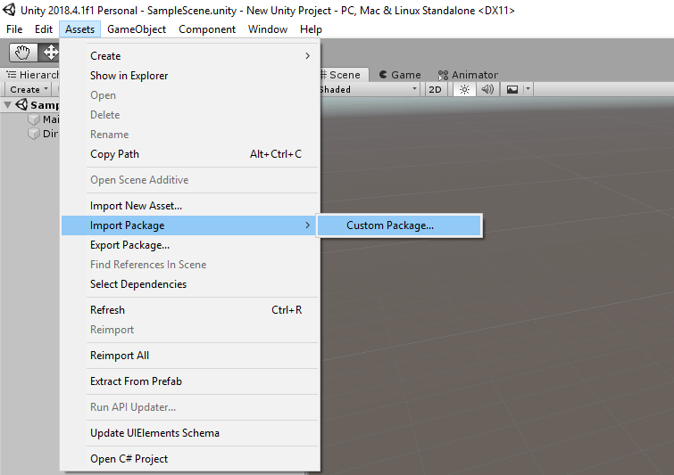
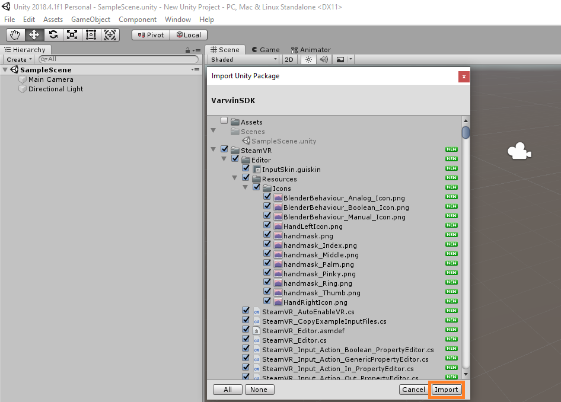
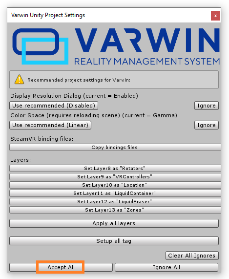
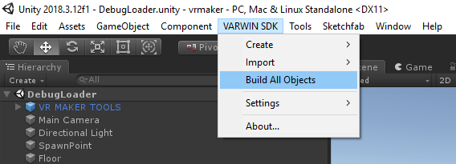

[Varwin SDK installation]{dir="ltr"}
====================================

[[[Переключить на
русский]{.underline}](https://docs.google.com/document/d/1CoIx6BhLCtkpc9Tu8avR0xLfnCY5g6XhBbzWoi59HfY/edit#)]{dir="ltr"}

[]{dir="ltr"}

[Varwin SDK comes as a Unity archive file (VarwinSDK.unitypackage). The
file is attached to the letter you received while [[installing the
Varwin
RMS]{.underline}](https://docs.google.com/document/d/154fkmOUdvtJHYM0NmCNBLEfukRp2kzetg4Zc6PGXNBE/edit#heading=h.6pzhcaqjibjv).
Download this file.]{dir="ltr"}

[In order to install SDK:]{dir="ltr"}

-   [In Unity 2018.4.1f1 open Assets - Import Package - Custom Package,
    > and select the archive with SDK that you've downloaded]{dir="ltr"}

{width="6.648682195975503in"
height="4.694840332458443in"}[]{dir="ltr"}

-   [You'll see a window with a list of elements for installation. Click
    > Import]{dir="ltr"}

{width="6.3468416447944005in"
height="4.538590332458443in"}[]{dir="ltr"}

-   [Then you'll see a window with the recommended project settings.
    > Click Accept All]{dir="ltr"}

{width="3.4298042432195976in"
height="4.174008092738408in"}[]{dir="ltr"}

-   [When the installation is complete, Varwin SDK section will appear
    > in the Unity menu.]{dir="ltr"}

{width="5.916666666666667in"
height="2.1354166666666665in"}[]{dir="ltr"}

[]{dir="ltr"}
