[[[Переключить на
русский]{.underline}](https://docs.google.com/document/d/1dgOK8-xAkveASEHpaUgxAV9BikJExMCDh1uIb764hRg/edit#)]{dir="ltr"}

[]{dir="ltr"}

[Contents]{dir="ltr"}

[[[Preparing your PC]{.underline}](#preparing-your-pc)]{dir="ltr"}

> [[[Steam installation]{.underline}](#steam-installation)]{dir="ltr"}
>
> [[[SteamVR
> installation]{.underline}](#steamvr-installation)]{dir="ltr"}
>
> [[[For WMR equipment: Windows Mixed Reality for SteamVR
> installation]{.underline}](#for-wmr-equipment-windows-mixed-reality-for-steamvr-installation)]{dir="ltr"}
>
> [[[For Oculus equipment: Oculus software
> installation]{.underline}](#for-oculus-equipment-oculus-software-installation)]{dir="ltr"}
>
> [[[Unity installation]{.underline}](#unity-installation)]{dir="ltr"}

[[[Varwin platform
installation]{.underline}](#varwin-platform-installation)]{dir="ltr"}

[[[Launching the
platform]{.underline}](#launching-the-platform)]{dir="ltr"}

[Preparing your PC]{dir="ltr"}
==============================

1.  [Check if your PC complies to our [[system
    > requirements]{.underline}](https://docs.google.com/document/d/1YnVCUts-NDuexkL_8lpMPlc_u6LR5m7oym-3rylly-g/edit#heading=h.3znysh7)]{dir="ltr"}

2.  [The following software must be installed on your PC in order for
    > the Varwin system to operate:]{dir="ltr"}

    a.  [Steam]{dir="ltr"}

    b.  [SteamVR]{dir="ltr"}

    c.  [Unity 2018.4.1f1 (for creating objects and/or scene
        > templates)]{dir="ltr"}

[Steam installation]{dir="ltr"}
-------------------------------

1.  [Download and run [[Steam
    > installer]{.underline}](https://steamcdn-a.akamaihd.net/client/installer/SteamSetup.exe)
    > following this link from [[official
    > source]{.underline}](https://store.steampowered.com)]{dir="ltr"}

2.  [Enter your Steam account. If you don't have one, please
    > register.]{dir="ltr"}

> 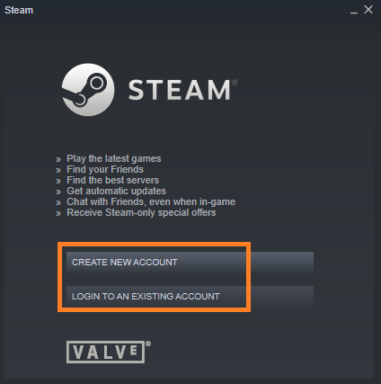{width="2.497989938757655in"
> height="2.51663167104112in"}[]{dir="ltr"}

[SteamVR installation]{dir="ltr"}
---------------------------------

1.  [Open Steam installed on your PC. Go to the Store section and search
    > for SteamVR (no space between the words.)]{dir="ltr"}

    a.  [Check if your PC complies to SteamVR requirements (run SteamVR
        > Performance Test) if necessary.]{dir="ltr"}

    b.  [Download SteamVR.]{dir="ltr"}

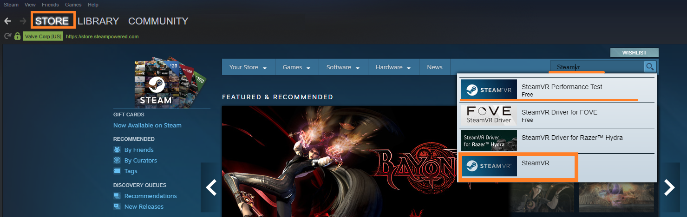{width="7.515748031496063in"
height="2.388888888888889in"}[]{dir="ltr"}

2.  [When SteamVR is downloaded, you'll be notified that it is in your
    > library. Click "Play Now" in order to install SteamVR.]{dir="ltr"}

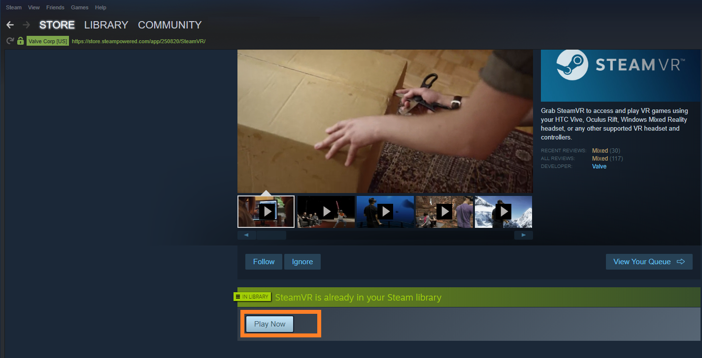{width="7.515748031496063in"
height="3.8472222222222223in"} [ ]{dir="ltr"}

3.  [Follow the instructions of the installer to install
    > SteamVR.]{dir="ltr"}

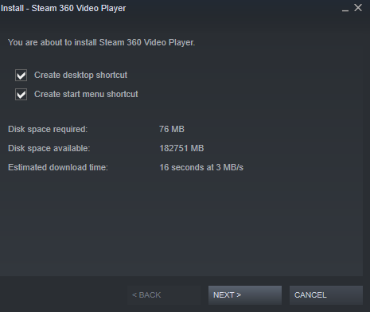{width="3.9049475065616797in"
height="3.299006999125109in"}[]{dir="ltr"}

[For WMR equipment: Windows Mixed Reality for SteamVR installation]{dir="ltr"}
------------------------------------------------------------------------------

[Those using Windows Mixed Reality equipment will have to install one
more program: Windows Mixed Reality for SteamVR. The installation
process is equivalent to that of SteamVR.]{dir="ltr"}

1.  [Open Steam installed on your PC. Go to the Store section and search
    > for Windows Mixed Reality for SteamVR. Download this
    > program.]{dir="ltr"}

[ ]{dir="ltr"}
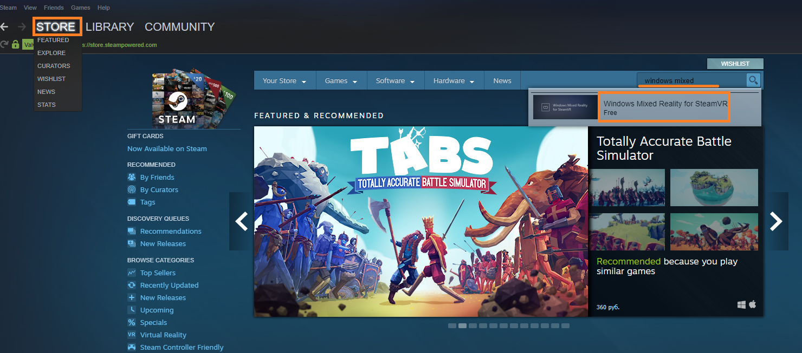{width="7.247991032370954in"
height="3.202366579177603in"}[]{dir="ltr"}

2.  [When the program is downloaded, you'll see a notification that you
    > can now Use it. Click "Free" in order to install Windows Mixed
    > Reality for SteamVR.]{dir="ltr"}

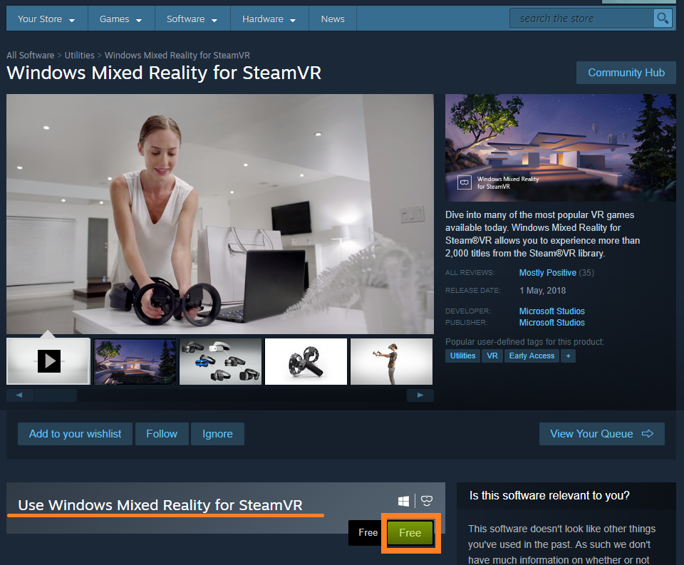{width="5.675778652668416in"
height="4.684424759405075in"} [ ]{dir="ltr"}

3.  [Follow the instructions of the installer to install Windows Mixed
    > Reality for SteamVR.]{dir="ltr"}

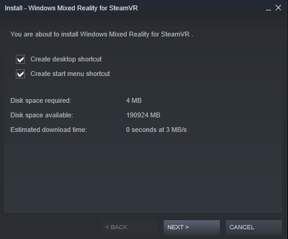{width="4.189725503062117in"
height="3.4760903324584427in"}[]{dir="ltr"}

[For Oculus equipment: Oculus software installation]{dir="ltr"}
---------------------------------------------------------------

[Those using Oculus equipment will have to install one more program:
Oculus software. Download it from official Oculus site using this link:
[[Get Started with
Rift]{.underline}](https://www.oculus.com/rift/setup/)]{dir="ltr"}

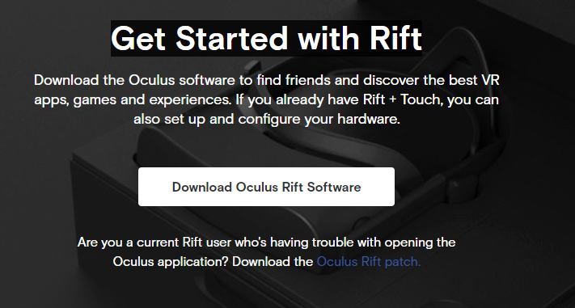{width="5.416370297462817in"
height="2.9031747594050743in"}[]{dir="ltr"}

[Unity installation]{dir="ltr"}
-------------------------------

[Follow this [[link from official
source]{.underline}](https://unity3d.com/get-unity/download/archive?_ga=2.19733694.707766669.1553265932-456492208.1549287338)
to install Unity 2018.4.1f1.]{dir="ltr"}

{width="7.515748031496063in"
height="0.6805555555555556in"}[]{dir="ltr"}

[Varwin platform installation]{dir="ltr"}
=========================================

1.  [Go to [[Varwin official website]{.underline}](https://varwin.com/).
    > Click "Prices" and select one.]{dir="ltr"}

2.  [You'll see the registration form. Please fill it in (all fields are
    > required.)]{dir="ltr"}

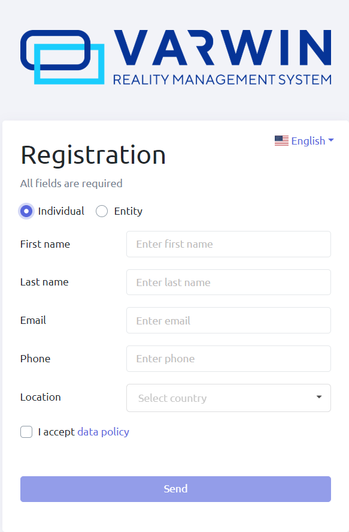{width="3.362709973753281in"
height="5.117658573928259in"}{width="3.179093394575678in"
height="5.853203193350831in"}[]{dir="ltr"}

3.  [Check your email. You must have received a letter containing links
    > for downloading Varwin installer and a license key. If you haven't
    > received the letter, please check your Spam folder.]{dir="ltr"}

    a.  [This email will include an attached file necessary for Varwin
        > SDK installation. If you need to install the Varwin SDK,
        > download the file. [[How to install the Varwin
        > SDK]{.underline}](https://drive.google.com/open?id=15_MIL6kOdS-BHaJs7M0eDz_XHCuBDrRLSxmBrYGYDlU)]{dir="ltr"}

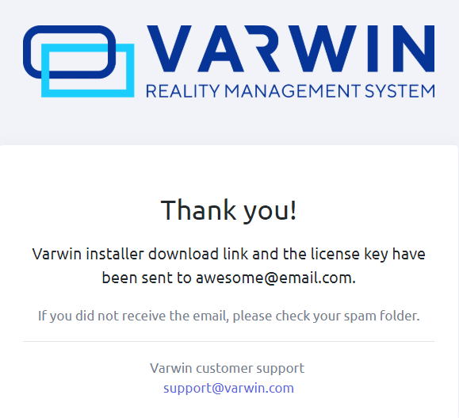{width="4.219640201224847in"
height="3.8406747594050743in"}[]{dir="ltr"}

4.  [Follow the link you've received to download Varwin installer. This
    > may take several minutes.]{dir="ltr"}

5.  [Follow the instructions of the installer to install Varwin
    > platform. This may take several minutes.]{dir="ltr"}

[ ]{dir="ltr"}
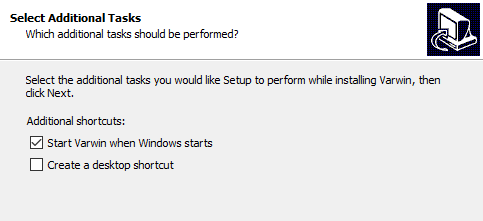{width="4.799082458442695in"
height="2.194841426071741in"}[]{dir="ltr"}

6.  [When Varwin is installed, its icon will appear in the notification
    > area in the bottom right corner of the screen. While the program
    > is launching, there will be a yellow dot on the icon. When the
    > program is work-ready, the dot will disappear.]{dir="ltr"}

[ ]{dir="ltr"}
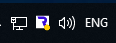{width="1.2083333333333333in"
height="0.4479166666666667in"}{width="1.3309776902887138in"
height="0.45099190726159233in"}[]{dir="ltr"}

[Launching the platform]{dir="ltr"}
===================================

1.  [Launch Varwin by double-clicking on the icon on your desktop, or by
    > double-clicking on the icon in the notification area, or via the
    > menu.]{dir="ltr"}

    a.  [When Varwin is installed, you can open the menu by right- or
        > left-clicking on the icon in the notification area]{dir="ltr"}

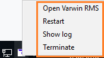{width="1.8229166666666667in"
height="1.0208333333333333in"}[]{dir="ltr"}

2.  [At the first launch, you will get several notifications from
    > Windows Firewall. Select "Allow access" (by doing this, you allow
    > access to certain Varwin services, without which the platform
    > won't run.)]{dir="ltr"}

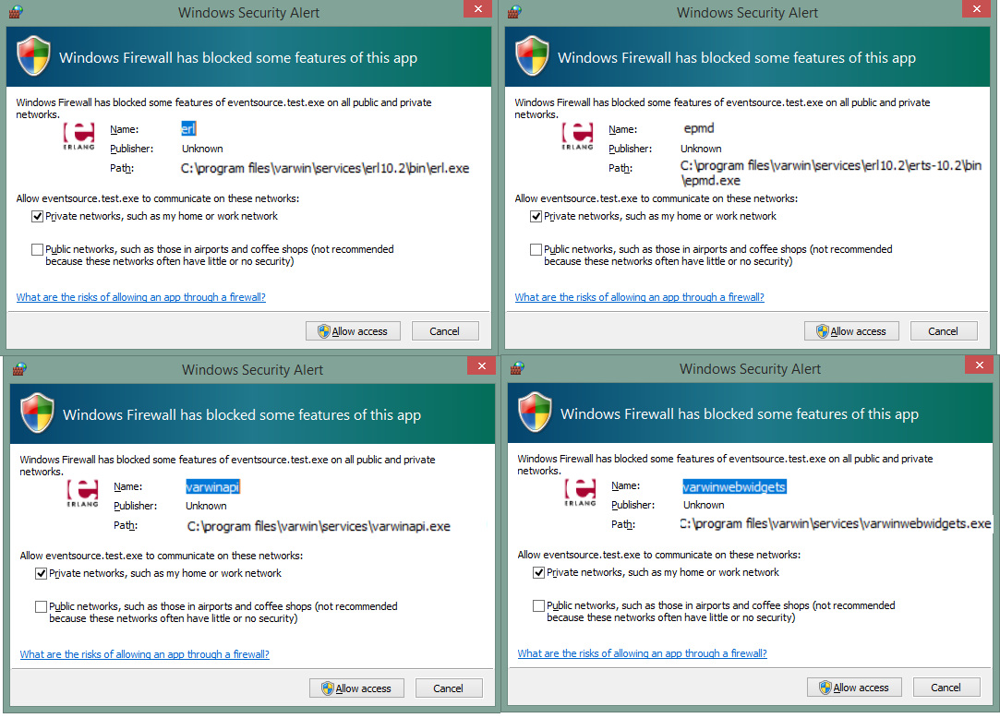{width="6.435491032370954in"
height="4.633969816272966in"}[]{dir="ltr"}

3.  [You'll see a license key window. Enter the key you've received in
    > the letter.]{dir="ltr"}

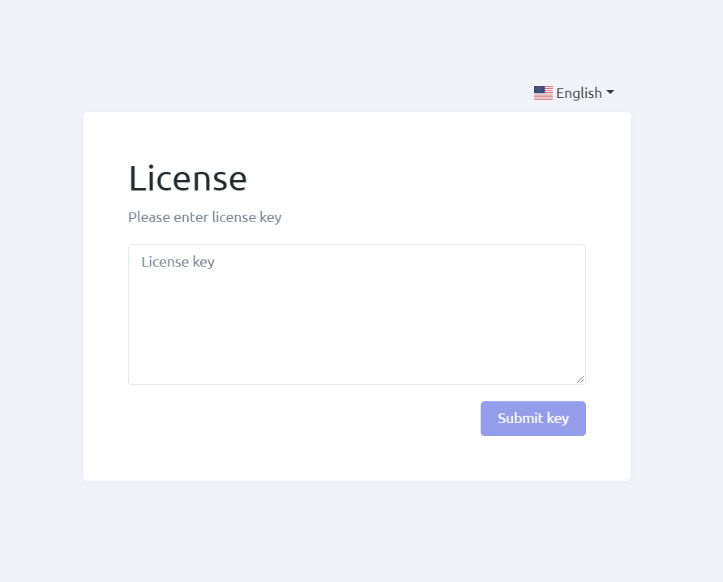{width="3.0292410323709538in"
height="2.274319772528434in"}[]{dir="ltr"}

4.  [You have successfully installed and launched Varwin.]{dir="ltr"}
