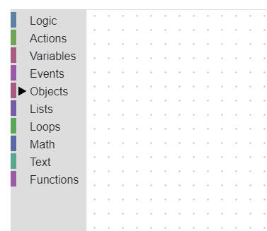

[[[Переключить на
русский]{.underline}](https://docs.google.com/document/d/1Gd9xwKW9dhcgzszyvIeFQjK_mbY3qgL24qCHUs5lxZw)]{dir="ltr"}

[]{dir="ltr"}

[Contents]{dir="ltr"}

[[[Introduction to
Blockly]{.underline}](#introduction-to-blockly)]{dir="ltr"}

> [[[Further reading]{.underline}](#further-reading)]{dir="ltr"}

[[[Standard sections]{.underline}](#standard-sections)]{dir="ltr"}

[[[Custom sections]{.underline}](#custom-sections)]{dir="ltr"}

> [[[Actions]{.underline}](#actions)]{dir="ltr"}
>
> [[[Events]{.underline}](#events)]{dir="ltr"}
>
> [[[Objects]{.underline}](#objects)]{dir="ltr"}
>
> [[[Blocks for objects]{.underline}](#blocks-for-objects)]{dir="ltr"}
>
> [[[Creating custom
> blocks]{.underline}](#creating-custom-blocks)]{dir="ltr"}
>
> [[[Further reading]{.underline}](#further-reading-1)]{dir="ltr"}

[[[How Blockly works on Varwin
platform]{.underline}](#how-blockly-works-on-varwin-platform)]{dir="ltr"}

[]{dir="ltr"}

[Introduction to Blockly]{dir="ltr"}
====================================

[Blockly is a visual code editor which does not require programming
skills. It allows writing program scripts by connecting visual blocks.
The blocks are divided into groups according to their purpose or return
value. Each group has its own colour. The shapes of the blocks also
vary; not all the blocks are compatible.]{dir="ltr"}

[If blocks fit together, the program will run. Still, logical errors can
arise in the process. The block causing the error will be
illuminated.]{dir="ltr"}

[Also, when the program runs in preview mode the blocks which are
executed at the moment are illuminated as well. This simplifies watching
the script in real time.]{dir="ltr"}

{width="1.3000732720909887in"
height="1.232159886264217in"} [ ]{dir="ltr"}

*[Illuminated block (is executed at the moment)]{dir="ltr"}*

[The blocks are managed (copied, deactivated, removed, etc.) by
right-clicking on them and keyboard shortcuts Ctrl+C,
Ctrl+V.]{dir="ltr"}

[The blocks can be expanded and collapsed by right-clicking on
them.]{dir="ltr"}

[Blockly interface consists of Workspace, where logic algorithms of the
project are built, and Toolbox - side menu from whence the user may
select blocks or create new ones.]{dir="ltr"}

{width="3.0701345144356957in"
height="2.649702537182852in"}[]{dir="ltr"}

[Blockly is used for composing scripts for VR projects powered by Varwin
platform. This opens access to our platform to users with no programmer
skills.]{dir="ltr"}

-   [Get acquainted with Blockly: [[training
    > games]{.underline}](https://blockly-games.appspot.com/?lang=en).]{dir="ltr"}

[Further reading]{dir="ltr"}
----------------------------

[[[Introduction to Blockly (official
site)]{.underline}](https://developers.google.com/blockly/guides/overview)]{dir="ltr"}

[Standard sections]{dir="ltr"} 
===============================

[Training games have acquainted you with the standard block sections.
These are used within Varwin platform:]{dir="ltr"}

-   **[Logic]{dir="ltr"}**

[Main logic blocks.]{dir="ltr"}

{width="2.1993383639545057in"
height="3.299006999125109in"}[]{dir="ltr"}

-   **[Variables]{dir="ltr"}**

[A variable is an area of memory where to store a certain value to refer
to it later. Strictly speaking, an object in itself is a
variable.]{dir="ltr"}{width="2.987574365704287in"
height="2.5039741907261592in"}[]{dir="ltr"}

-   **[Lists]{dir="ltr"}**

[Set of blocks allowing to work with lists. A list is a set of variables
of any type.]{dir="ltr"}

{width="3.3729910323709538in"
height="3.4481846019247593in"}[]{dir="ltr"}

-   **[Loops]{dir="ltr"}**

[Blocks allowing to set a number of actions with foregone iteration
count. Can be used also to avoid lists.]{dir="ltr"}

{width="3.404355861767279in"
height="3.111506999125109in"}[]{dir="ltr"}

-   **[Math]{dir="ltr"}**

[Set of blocks allowing to work with numbers.]{dir="ltr"}

{width="2.4220997375328084in"
height="2.861506999125109in"}[]{dir="ltr"}

-   **[Text]{dir="ltr"}**

[Set of blocks allowing to work with texts.]{dir="ltr"}

{width="5.375354330708661in"
height="5.434424759405075in"}[]{dir="ltr"}

-   **[Functions]{dir="ltr"}**

[Set of blocks allowing to create and call functions. Functions are good
for structuring and multiple use of repeatable logic.]{dir="ltr"}

{width="3.3521576990376203in"
height="2.380358705161855in"}[]{dir="ltr"}

[Custom sections]{dir="ltr"}
============================

[These sections have been created specially for Varwin
platform.]{dir="ltr"}

[Actions]{dir="ltr"}
--------------------

[Commands which invoke certain system actions.]{dir="ltr"}

{width="4.052083333333333in"
height="1.34375in"}[]{dir="ltr"}

[Events]{dir="ltr"}
-------------------

[All the blocks in the workspace are executed on the frame to frame
basis. The exceptions are blocks from Function and Event
groups.]{dir="ltr"}

[Blocks placed inside an event are executed only at the moment of an
event.]{dir="ltr"}

[Events section stores general system events; e.g., **on init** (at the
moment of initialization) event.]{dir="ltr"}

{width="2.09375in"
height="1.3229166666666667in"}[]{dir="ltr"}

[Blocks that are inside this event are operated only once, at the moment
of scene load or of changing the mode to Preview.]{dir="ltr"}

[This block is good for the initialization of objects state within a
scene, e.g., switching on a button which is switched off by default. The
block can be used multiple times.]{dir="ltr"}

[**Example**]{dir="ltr"}

{width="10.020833333333334in"
height="2.977826990376203in"}[]{dir="ltr"}

-   [сommands 1, 2 are executed only once at the moment of scene load or
    > of changing the mode to Preview,]{dir="ltr"}

-   [command 3 is executed frame by frame,]{dir="ltr"}

-   [command 4 is executed at the moment of event (pressing on the
    > panel.)]{dir="ltr"}

[Objects]{dir="ltr"}
--------------------

[Objects spawned on the scene in VR are displayed in this section.
Available states (variables) for each object are shown as well (ill.
1)]{dir="ltr"}

-   [**object:any** is a section with blocks that can be applied to any
    > object.]{dir="ltr"}

-   [Objects added to a scene are grouped by type (ill.2: area, button,
    > display, etc.) The specific object can be selected from the
    > drop-down list (ill.3)]{dir="ltr"}

{width="3.7271576990376203in"
height="4.351602143482065in"}{width="2.2402318460192476in"
height="1.628076334208224in"}[]{dir="ltr"}

[*ill.1 ill.2*]{dir="ltr"}

{width="1.0604899387576554in"
height="0.5008727034120735in"}[]{dir="ltr"}

[*ill.3*]{dir="ltr"}

### [Blocks for objects]{dir="ltr"}

  **[Section]{dir="ltr"}**   **[Name]{dir="ltr"}**   **[Purpose]{dir="ltr"}**           **[Picture]{dir="ltr"}**
  -------------------------- ----------------------- ---------------------------------- -----------------------------------------------------------------------------------------------------------------------
  [Logic]{dir="ltr"}         [checker]{dir="ltr"}    [check true/false]{dir="ltr"}      {width="2.3541666666666665in" height="0.6111111111111112in"}[]{dir="ltr"}
  [Action]{dir="ltr"}        [action]{dir="ltr"}     [Actions with object]{dir="ltr"}   {width="2.3541666666666665in" height="0.5277777777777778in"}[]{dir="ltr"}
  [Variables]{dir="ltr"}     [getter]{dir="ltr"}     [Get a state]{dir="ltr"}           {width="2.1021576990376203in" height="0.5356463254593176in"}[]{dir="ltr"}
  []{dir="ltr"}              [setter]{dir="ltr"}     [Set a state]{dir="ltr"}           {width="2.4395089676290462in" height="0.4435476815398075in"}[]{dir="ltr"}
  [Events]{dir="ltr"}        [event]{dir="ltr"}      [Events with object]{dir="ltr"}    {width="0.7271576990376203in" height="0.6579046369203849in"}[]{dir="ltr"}

### [Creating custom blocks]{dir="ltr"}

[Custom blocks can be created along with object code. See an example
here: [[Creating objects for Varwin in Unity -
Example]{.underline}](https://docs.google.com/document/d/1hsiaY3RPNxpEiCmi49X1WuThOj3C-a0yksD43CJXfFc/edit#heading=h.30j0zll)]{dir="ltr"}

[Further reading]{dir="ltr"}
----------------------------

[[[Custom blocks (official
site)]{.underline}](https://developers.google.com/blockly/guides/configure/web/custom-blocks)]{dir="ltr"}

[How Blockly works on Varwin platform]{dir="ltr"}
=================================================

-   [To open Blockly,]{dir="ltr"}

    -   [Open relevant project,]{dir="ltr"}

    -   [Click "Open visual logic editor".]{dir="ltr"}

{width="7.685491032370954in"
height="2.584330708661417in"}[]{dir="ltr"}

{width="2.8617989938757655in"
height="3.549006999125109in"}[]{dir="ltr"}

-   [The new algorithm can be immediately checked in VR. To do it, click
    > 'Run in VR.']{dir="ltr"}

{width="2.987574365704287in"
height="0.556509186351706in"}[]{dir="ltr"}

-   [Languages: English, Russian.]{dir="ltr"}

{width="2.5729166666666665in"
height="1.4166666666666667in"}[]{dir="ltr"}

-   [Logic set in the script is executed in VR frame by frame, except
    > Function and Event blocks.]{dir="ltr"}
